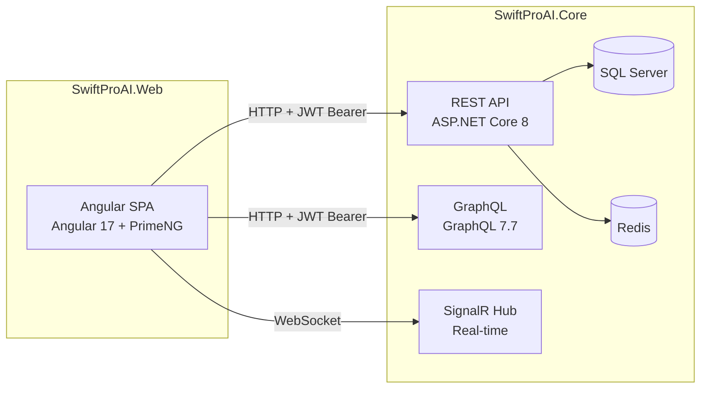

# SwiftProAI

SwiftProAI is an insurance-tech SaaS platform for managing claims, cases, registrations and stakeholder workflows. The repository is organised into two projects — a .NET backend and an Angular frontend — that work together as a full-stack web application.

---

## Repository structure

```
SwiftProAI-V1/
├── SwiftProAI.Core/    Backend API, domain logic and database layer
└── SwiftProAI.Web/     Angular frontend and end-to-end tests
```

---

## SwiftProAI.Core

The backend is built on **ASP.NET Core 8** using the **ABP (ASP.NET Boilerplate)** framework. It provides a REST API, a GraphQL endpoint and real-time SignalR support. The domain covers insurance case management, multi-tenant SaaS, document OCR, payment processing and background job execution.

Key technologies: .NET 8, ABP 9.1 / ASP.NET Zero 5, Entity Framework Core 8, SQL Server, Redis, Hangfire, SignalR, OpenIddict, Stripe, PayPal, Twilio and Docker.

See [`SwiftProAI.Core/README.md`](SwiftProAI.Core/README.md) for full documentation, architecture diagrams and setup instructions.

---

## SwiftProAI.Web

The frontend is built on **Angular 17** with **PrimeNG** and **Metronic** (13 switchable themes). It communicates with the backend via NSwag-generated typed service proxies and includes real-time chat and notifications via SignalR. End-to-end tests are written in Playwright.

Key technologies: Angular 17, TypeScript 5.2, PrimeNG 17, ngx-bootstrap 12, Metronic, SignalR, NSwag, Playwright and Karma.

See [`SwiftProAI.Web/README.md`](SwiftProAI.Web/README.md) for full documentation, architecture diagrams and setup instructions.

---

## How the two projects connect



The Angular build output is written directly into the Core project's `wwwroot` folder so the .NET host can serve both the API and the SPA from a single process.

---

## Quick start

1. Start the backend — see [SwiftProAI.Core/README.md](SwiftProAI.Core/README.md)
2. Start the frontend — see [SwiftProAI.Web/README.md](SwiftProAI.Web/README.md)
3. Open `http://localhost:4200` in your browser

---

## Licence

Proprietary. All rights reserved — ABOD Technology Services.
