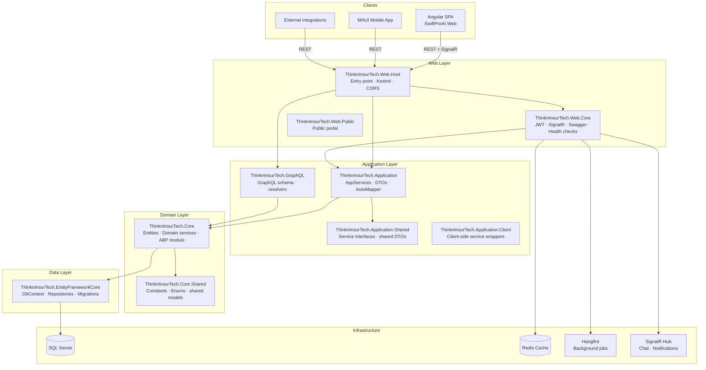
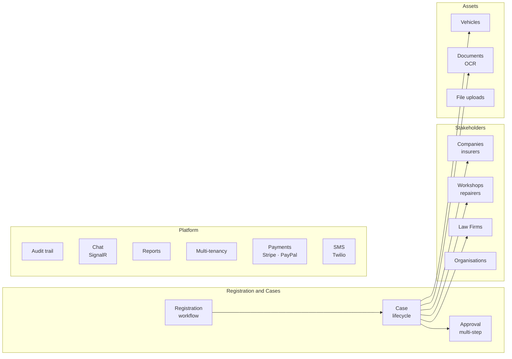

# SwiftProAI.Core

Backend API and domain layer for SwiftProAI — an insurance-tech SaaS platform built on ASP.NET Core 8 and the ABP (ASP.NET Boilerplate) framework.

---

## Tech stack

| Layer | Technology |
|-------|-----------|
| Runtime | .NET 8.0 |
| Framework | ASP.NET Core + ABP 9.1.3 / ASP.NET Zero 5.0 |
| ORM | Entity Framework Core 8 (SQL Server) |
| Auth | JWT Bearer, OpenIddict (OAuth2/OIDC), ABP Zero |
| Real-time | SignalR |
| Background jobs | Hangfire (SQL Server backing store) |
| Caching | Redis (Abp.RedisCache) |
| API | REST (ABP dynamic controllers) and GraphQL 7.7 |
| Docs | Swagger / OpenAPI (Swashbuckle) |
| Mobile | .NET MAUI (iOS, Android, Windows, macOS) |
| Payments | Stripe and PayPal |
| SMS | Twilio |
| OCR | OpenAI-backed document recognition |
| Containers | Docker and Docker Compose |

---

## Architecture



### Layer responsibilities

**Web.Host** — application entry point. Configures Kestrel, CORS, middleware pipeline and environment-specific settings.

**Web.Core** — web-layer infrastructure shared across host and public portal. Owns JWT configuration, SignalR hub registration, Swagger setup, health check endpoints and OpenIddict OIDC configuration.

**Application** — all business use cases implemented as ABP AppServices. Handles DTO mapping via AutoMapper (`CustomDtoMapper.cs`), data export/import (Excel, PDF) and integration orchestration (OCR, payments, SMS).

**Application.Shared** — service interfaces and DTOs that are shared with client projects (MAUI app, console client). Consumed by the Angular frontend via NSwag-generated proxies.

**Core** — domain entities, domain services, events and ABP module wiring. All business invariants live here. Never bypass this layer by writing queries directly in Application or Web.

**EntityFrameworkCore** — `ThinknInsurTechDbContext`, EF repositories and all migrations. Schema was migrated from PostgreSQL to SQL Server in the initial migration.

---

## Domain areas



---

## Project layout

```
aspnet-core/
├── src/
│   ├── ThinknInsurTech.Core
│   ├── ThinknInsurTech.Core.Shared
│   ├── ThinknInsurTech.Application
│   ├── ThinknInsurTech.Application.Shared
│   ├── ThinknInsurTech.Application.Client
│   ├── ThinknInsurTech.EntityFrameworkCore
│   ├── ThinknInsurTech.GraphQL
│   ├── ThinknInsurTech.Web.Core
│   ├── ThinknInsurTech.Web.Host
│   ├── ThinknInsurTech.Web.Public
│   ├── ThinknInsurTech.Migrator
│   └── ThinknInsurTech.Mobile.MAUI
├── test/
│   ├── ThinknInsurTech.Tests
│   ├── ThinknInsurTech.GraphQL.Tests
│   ├── ThinknInsurTech.Test.Base
│   └── ThinknInsurTech.ConsoleApiClient
└── docker/
```

---

## Getting started

### Prerequisites

- .NET 8 SDK
- SQL Server (local or Docker)
- Redis (local or Docker)
- Node.js 18+ (only if building the Angular frontend)

### 1. Configure the database

Update the connection string in `appsettings.json`:

```json
"ConnectionStrings": {
  "Default": "Server=localhost; Database=ThinknInsurTechDb; Trusted_Connection=True; TrustServerCertificate=True;"
}
```

### 2. Run migrations

```bash
cd aspnet-core/src/ThinknInsurTech.Migrator
dotnet run
```

### 3. Start the host

```bash
cd aspnet-core/src/ThinknInsurTech.Web.Host
dotnet run
```

The API is available at `https://localhost:44301` by default (configured in `appsettings.json` under `App.ServerRootAddress`).

Swagger UI: `https://localhost:44301/swagger`
GraphQL playground: `https://localhost:44301/graphql`

### Docker (alternative)

```bash
cd aspnet-core/docker
docker compose -f docker-compose.infrastructure.yml up -d   # SQL Server and Redis
docker compose -f docker-compose.migrator.yml up            # Apply migrations
docker compose -f docker-compose-host.yml up                # Web host
```

---

## Configuration files

| File | Environment |
|------|------------|
| `appsettings.json` | Development (default) |
| `appsettings.Production.json` | Production |
| `appsettings.Staging.json` | Staging |
| `appsettings.SIT.json` | System integration testing |
| `appsettings.UAT.json` | User acceptance testing |

Key sections: `ConnectionStrings`, `Abp.RedisCache`, `App` (CORS origins, root URLs), `Authentication` (JWT, social logins), `Payment` (Stripe, PayPal), `Twilio`, `Recaptcha`, `OCR`, `FileUpload`.

---

## Adding a migration

```bash
cd aspnet-core/src/ThinknInsurTech.EntityFrameworkCore
dotnet ef migrations add <MigrationName> \
  --startup-project ../ThinknInsurTech.Web.Host
```

---

## API endpoints

| Endpoint | Description |
|----------|------------|
| `POST /api/TokenAuth/Authenticate` | Obtain JWT token |
| `GET  /api/services/app/**` | ABP dynamic REST endpoints |
| `POST /graphql` | GraphQL queries and mutations |
| `GET  /swagger` | OpenAPI documentation |
| `GET  /healthz` | Health check |

---

## Running tests

```bash
dotnet test aspnet-core/ThinknInsurTech.Web.sln
```

---

## Deployment notes

- Run the Migrator before every deploy to apply pending schema changes
- Rotate `Authentication.JwtBearer.SecurityKey` per environment — never share keys across environments
- `OCR.IsOCREnabled` can be toggled in appsettings to disable OpenAI calls without a code change
- `UseEncryptedConnectionString` encrypts the connection string at rest — enable in production
- File uploads are stored on disk at the path configured in `Folder.root` — ensure the host has write access to that path

---

## Licence

Proprietary. All rights reserved — ABOD Technology Services.
