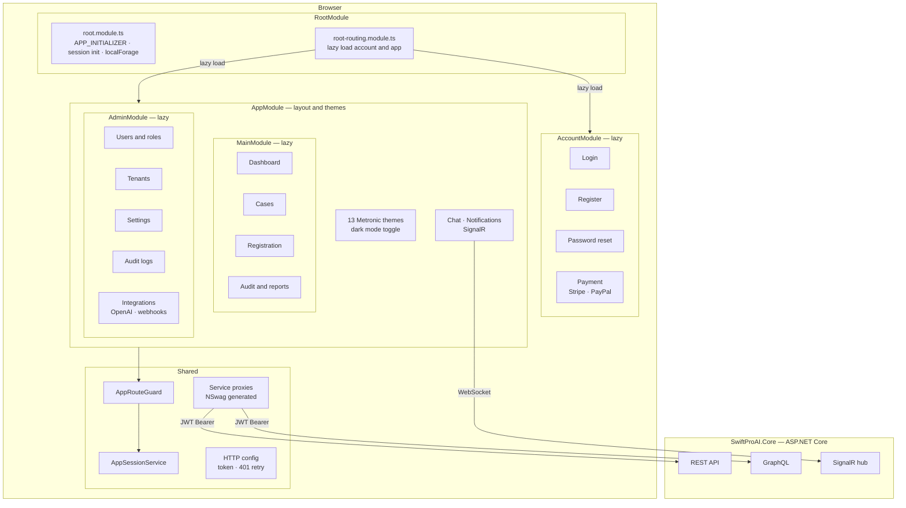
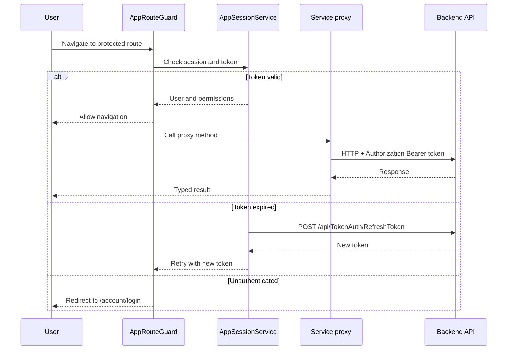
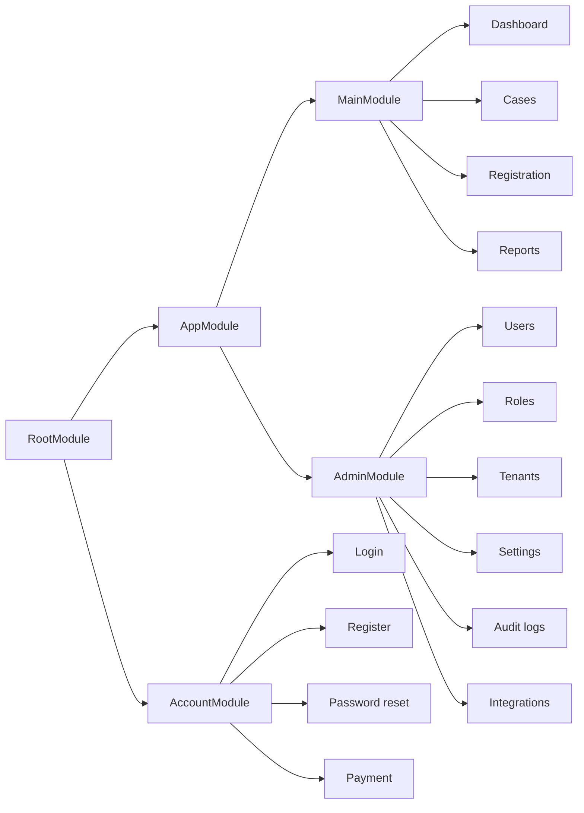

# SwiftProAI.Web

Angular 17 frontend for SwiftProAI — an insurance-tech SaaS platform. Communicates with the `SwiftProAI.Core` ASP.NET Core backend via auto-generated NSwag service proxies, supports 13 switchable Metronic themes and includes real-time chat and notifications via SignalR.

---

## Tech stack

| Category | Technology |
|----------|-----------|
| Framework | Angular 17.1.2 |
| Language | TypeScript 5.2.2 |
| UI components | PrimeNG 17.5.0 and ngx-bootstrap 12.0.0 |
| Theme | Metronic (13 variants, dark/light mode) |
| Real-time | @microsoft/signalr 8.0.0 |
| Charts | ngx-charts 20.5.0 and Chart.js 4.4.0 |
| Calendar | FullCalendar 6.1.9 |
| Rich text | Quill 1.3.7 |
| Auth (OIDC) | angular-oauth2-oidc 17.0.1 and @azure/msal-browser 3.7.1 |
| API clients | NSwag 14.0.3 (auto-generated from OpenAPI) |
| E2E tests | Playwright |
| Unit tests | Karma 6.4.2 and Jasmine 5.1.1 |
| Linting | ESLint 8.54.0 and Prettier 3.2.5 |
| Build | Angular CLI 17.1.2 and Gulp 4.0.2 |

---

## Architecture



### Request flow



---

## Module structure



---

## Getting started

### Prerequisites

- Node.js 18+
- npm 9+
- Angular CLI 17: `npm install -g @angular/cli@17`
- `SwiftProAI.Core` backend running (for API calls and proxy generation)

### 1. Install dependencies

```bash
cd angular
npm install
```

### 2. Configure the API base URL

Edit `src/assets/appconfig.json` and set:

```json
{
  "remoteServiceBaseUrl": "https://localhost:44301",
  "appBaseUrl": "http://localhost:4200"
}
```

### 3. Start the dev server

```bash
npm start
```

The app is available at `http://localhost:4200`.

---

## Build targets

| Command | Target | Output |
|---------|--------|--------|
| `npm start` | Development | Dev server on :4200 |
| `npm run hmr` | HMR dev | Dev server with Hot Module Replacement |
| `npm run publish` | Production | `wwwroot/` inside Core project |
| `npm run publish-k8s` | Kubernetes | `wwwroot/` with k8s appconfig |

---

## Regenerating API proxies

After any backend API change, regenerate the typed service proxies:

```bash
npm run nswag
```

This reads `nswag/service.config.nswag` and overwrites files under `src/shared/service-proxies/`. Never edit those files by hand.

---

## Project layout

```
angular/src/
├── main.ts                       Entry point
├── root.module.ts                Root module — session bootstrap
├── root-routing.module.ts        Lazy route loading, body CSS management
├── account/                      Unauthenticated pages
│   ├── login/
│   ├── register/
│   ├── password/
│   └── payment/                  Stripe and PayPal
├── app/
│   ├── app.module.ts             Layout — 13 themes, chat, notifications
│   ├── app-routing.module.ts     Guarded app routes
│   ├── main/                     User features
│   └── admin/                    Admin features
└── shared/
    ├── common/                   Session, auth, UI customisation, localisation
    ├── service-proxies/          NSwag-generated API clients (do not edit)
    ├── utils/
    ├── AppConsts.ts              Global constants
    └── AppEnums.ts               Shared enums
```

---

## Key services

| Service | Responsibility |
|---------|---------------|
| `AppSessionService` | Authenticated user and tenant context |
| `AppAuthService` | Logout, token cleanup |
| `AppRouteGuard` | Auth and permission guard for all app routes |
| `AppUiCustomizationService` | Theme selection, CSS class management |
| `ChatSignalrService` | SignalR connection — chat and notifications |
| `RefreshTokenService` | Automatic token refresh on 401 |
| `ZeroTemplateHttpConfigurationService` | HTTP interceptor — token injection and error handling |

---

## Themes

The app ships with 13 Metronic theme variants. The active theme is stored in user preferences and applied by `AppUiCustomizationService` as a CSS class on `<body>`. A dark mode toggle is available independently of theme selection.

---

## Testing

### Unit tests

```bash
npm test
```

Runs with Karma and Jasmine in headless Chrome. Coverage reports output to `coverage/`.

### E2E tests (Playwright)

```bash
cd ui-tests-playwright
npx playwright test
```

Screenshots are compared with a pixel tolerance of 100 pixels. Traces are recorded on the first retry. Requires the backend to be running.

---

## Docker

The production image uses nginx to serve the compiled Angular bundle:

```dockerfile
FROM nginx:latest
COPY ./dist /usr/share/nginx/html
```

Build the Angular app first (`npm run publish`), then build the Docker image from the `angular/` directory. Compose configs for different deployment topologies live under `build/`.

---

## Linting and formatting

```bash
npm run lint        # ESLint
npx prettier --write "src/**/*.ts"
```

---

## Licence

Proprietary. All rights reserved — ABOD Technology Services.
