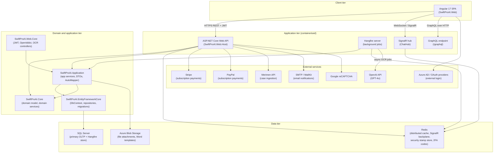
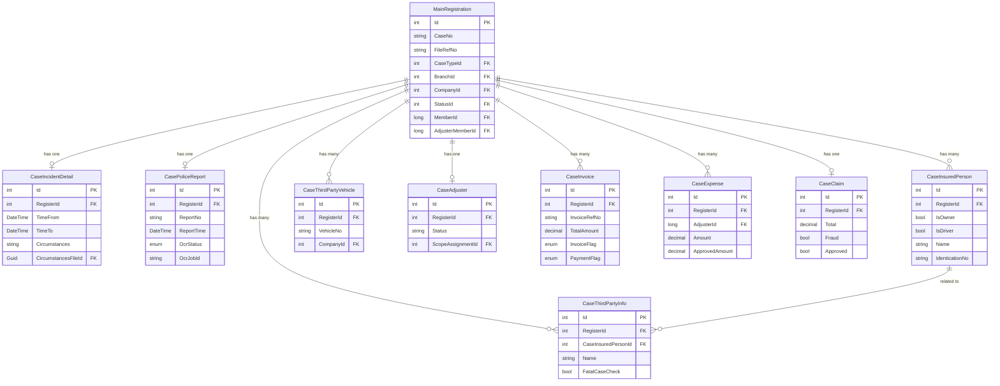
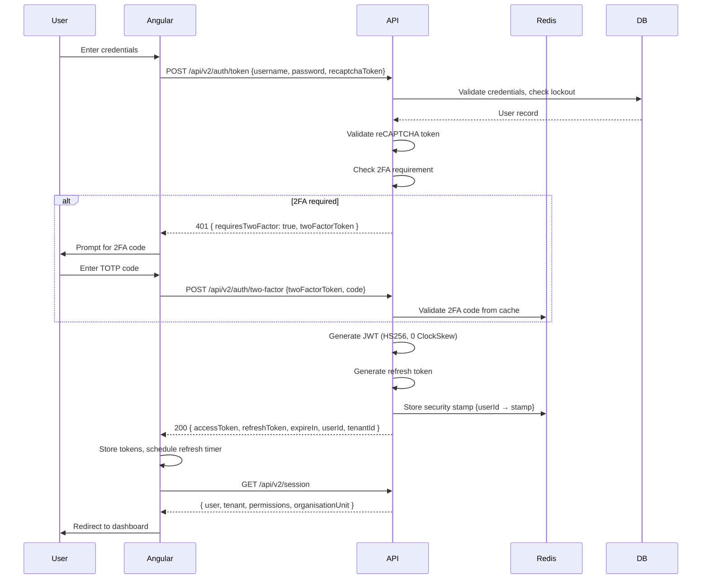
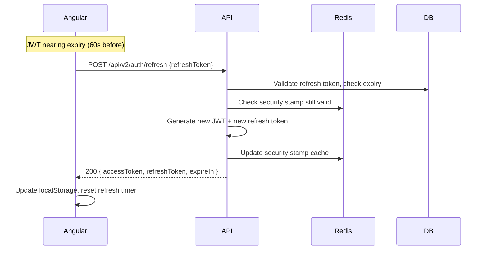
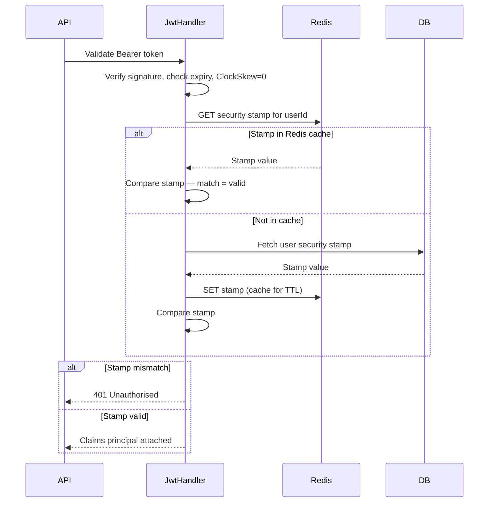
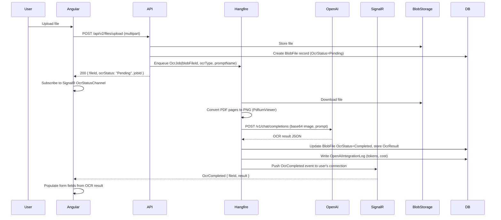
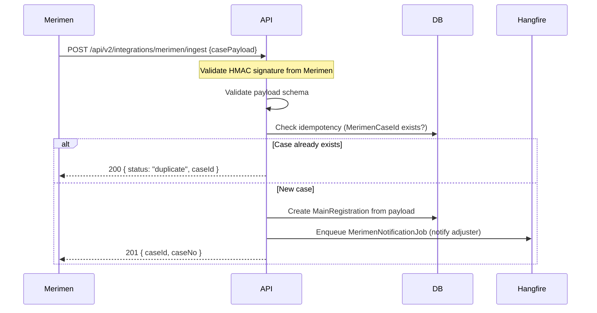
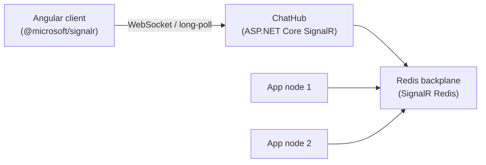

# SwiftProAI v2 — technical specification

**Version:** 1.0 Draft
**Date:** 12/06/2026
**Status:** For review
**Author:** Technical Analysis Team
**Audience:** Solution architects, senior developers, infrastructure engineers

> This is general information only. Please confirm with the relevant team before use.

---

## Table of contents

1. [Executive summary](#1-executive-summary)
2. [System architecture overview](#2-system-architecture-overview)
3. [Backend architecture](#3-backend-architecture)
4. [Frontend architecture](#4-frontend-architecture)
5. [Authentication and authorisation](#5-authentication-and-authorisation)
6. [Integration architecture](#6-integration-architecture)
7. [Infrastructure and deployment](#7-infrastructure-and-deployment)
8. [Security architecture](#8-security-architecture)
9. [Non-functional requirements — technical implementation](#9-non-functional-requirements--technical-implementation)
10. [Technical debt from v1](#10-technical-debt-from-v1)
11. [v2 technical recommendations](#11-v2-technical-recommendations)
12. [Data migration plan](#12-data-migration-plan)
13. [API versioning strategy](#13-api-versioning-strategy)

---

## 1. Executive summary

### 1.1 Purpose

This document defines the technical architecture, design decisions and implementation guidelines for SwiftProAI v2. It is the authoritative technical reference for the v2 development programme and covers the backend platform, frontend application, infrastructure, security model, integration layer and data migration.

### 1.2 Scope

This specification covers:

- The complete redesigned system architecture for v2
- A detailed domain model derived from reverse engineering of the v1 codebase (commit `b457674`, 12/06/2026)
- All API surfaces, integration contracts and security controls
- Infrastructure and deployment targets (containerised, cloud-capable)
- Resolution of all known technical debt items identified in v1
- A structured migration path from v1 data and APIs

This document does not define business rules, screen designs or user stories — those are covered in the Functional Specification. Where this document references functional requirements, it does so only to describe how they are technically implemented.

### 1.3 Relationship to other documents

| Document | Relationship |
|---|---|
| Functional Specification v2 | Parent document. This spec implements those requirements. |
| v1 Technical Architecture Specification (01/10/2023, 29/04/2024) | Predecessor. Superseded by this document. Note: the v1 architecture documents are materially inaccurate — they reference MySQL as the database (actual implementation uses SQL Server), describe an MVC pattern (actual implementation is API-first with an Angular SPA), and state "no batch jobs" (Hangfire and ABP background workers are present). Do not use those documents as reference. |
| ER Diagram (PNG) | Low-resolution artefact. All entity detail in this specification has been derived from codebase analysis, which is authoritative. |

### 1.4 Approach

v2 is a targeted evolution rather than a greenfield rewrite. The ABP Framework foundation and Angular SPA are retained. The primary changes are:

- Resolution of all production-blocking and high-severity technical debt items
- Containerisation and cloud-readiness
- Enablement of Redis, distributed caching and a SignalR backplane
- Decoupling of the OCR/AI pipeline from the synchronous HTTP request path
- Correction of financial data types
- Completion of incomplete integrations (OCR endpoints, Merimen, PayPal)
- Hardened security posture (production certificates, CSRF protection, authorisation coverage)

---

## 2. System architecture overview

### 2.1 Architecture style

SwiftProAI v2 uses a **modular monolith** pattern on the backend, retaining the ABP Framework layered architecture but with clearly enforced module boundaries. High-intensity concerns — specifically the AI/OCR processing pipeline — are decoupled from the synchronous request path via an internal message queue. The frontend remains a single-page application.

Key architectural characteristics:

- **API-first**: All backend functionality is exposed through a versioned REST API. The Angular SPA is a first-party consumer of the same API surface available to third-party integrators.
- **Event-driven OCR pipeline**: File uploads return immediately; OCR processing occurs asynchronously via Hangfire job queues. Results are pushed to the frontend via SignalR.
- **Multi-tenant SaaS**: ABP Zero multi-tenancy is retained. Each tenant is isolated at the data layer. Shared reference data (Location, Hospital, Vehicle, Lookup for global picklists) remains non-tenant-scoped.
- **Containerised deployment**: Docker containers orchestrated via Docker Compose for local development and Kubernetes or Azure Container Apps for higher environments.

### 2.2 Component diagram



### 2.3 Technology decisions and rationale

| Technology | Version | Decision | Rationale |
|---|---|---|---|
| ASP.NET Core | 8.0 LTS | Retain | Production-supported LTS; ABP 9.1 targets .NET 8 |
| ABP Framework (AspNetZero) | 9.1 | Retain | Multi-tenancy, identity, RBAC, audit logging are already production-grade; rewriting would not add value |
| Entity Framework Core | 8.0 | Retain | Deep integration with ABP; SQL Server provider works well at v1 scale |
| SQL Server | 2022 | Retain | v1 implementation target; Azure SQL compatible for cloud migration |
| Angular | 17 | Retain with incremental migration | Major rewrite not justified; migrate to standalone components incrementally |
| PrimeNG | 17 | Standardise on this | Remove ngx-bootstrap dependency; standardise on PrimeNG for all UI components |
| Redis | 7.x | Add (was commented out in v1) | Required for distributed cache, SignalR backplane, security stamp validation, 2FA code storage |
| Hangfire | 1.8 | Retain and enable | Background job infrastructure already wired; enable dashboard with auth; use for async OCR pipeline |
| SignalR | ASP.NET Core built-in | Retain with Redis backplane | Real-time chat is a core feature; Redis backplane required for multi-node deployments |
| Docker | 24+ | Add | Containerise all services for consistent environments and cloud portability |
| Azure Blob Storage | SDK v12 | Add | Replace ABP BinaryObject DB storage for file attachments; scale storage independently |
| OpenTelemetry | 1.x | Add | Distributed tracing across HTTP, EF Core and OpenAI calls; essential for debugging async OCR pipeline |
| OpenIddict | 5.x | Retain with production certificates | Replace development certificates with real signing and encryption certificates |

---

## 3. Backend architecture

### 3.1 Project structure

The backend follows a clean layered architecture aligned with ABP Framework conventions. The namespace prefix changes from `ThinknInsurTech` to `SwiftProAI` in v2.

```
SwiftProAI.sln
├── SwiftProAI.Core                    # Domain layer
├── SwiftProAI.Application             # Application layer
├── SwiftProAI.Application.Shared      # Shared DTOs and interfaces (consumed by frontend proxy gen)
├── SwiftProAI.EntityFrameworkCore     # Data access layer
├── SwiftProAI.Web.Core                # Web infrastructure (JWT, OpenIddict, hub base classes)
├── SwiftProAI.Web.Host                # Presentation layer (Startup, controllers, Swagger host)
├── SwiftProAI.GraphQL                 # GraphQL schema and resolvers
└── SwiftProAI.Migrator                # Database migration runner (standalone executable)
```

#### SwiftProAI.Core — domain layer

Responsibilities:
- Entity definitions, domain events and aggregate roots
- Domain service interfaces and implementations (e.g. case assignment logic, invoice generation rules)
- Manager classes for complex multi-entity operations
- Enums, constants and value objects
- Custom `IAbpSession` implementation (`OuAbpSession`)
- Audit attribute definitions (`[Auditable]`, `[AuditedTrail]`)
- `AuthorizationProvider` — permission tree definition

No dependencies on EF Core, HTTP or application services.

#### SwiftProAI.Application — application layer

Responsibilities:
- Application service implementations (CRUD orchestration, business workflow)
- Data Transfer Objects (DTOs) for request and response
- AutoMapper profiles (entity-to-DTO mapping)
- Application layer interfaces consumed by Web.Core controllers
- Report query services (WIP, case cross-tab, adjuster reports)
- Document export service (`RegistrationExporterAppService`)

Depends on: Core only. Does not reference EF Core directly — uses repository interfaces.

#### SwiftProAI.EntityFrameworkCore — data access layer

Responsibilities:
- `SwiftProAIDbContext` (inherits `AbpZeroDbContext`)
- EF Core entity configuration (fluent API, indexes, constraints)
- Migration files
- Custom repository implementations where generic repository is insufficient
- `DbContextConfigurer`, `DbContextFactory` (design-time)
- Custom `SaveChangesAsync` override for field-level audit trail

Depends on: Core. Exposes repository implementations to Application via DI.

#### SwiftProAI.Web.Core — web infrastructure

Responsibilities:
- JWT bearer handler (`SwiftProAIAsyncJwtBearerHandler`)
- OpenIddict registration and certificate management
- Controller base classes
- OCR controller (`OCRController`, `FileOcrController`) — these are thin HTTP adapters; logic lives in Application
- SignalR hub base wiring
- Startup module extensions

#### SwiftProAI.Web.Host — presentation layer

Responsibilities:
- `Startup.cs` and `Program.cs`
- ASP.NET Core controller hosting
- Swagger/OpenAPI configuration
- Hangfire registration and dashboard
- CORS policy
- SPA static file hosting (serves Angular build output)
- Stripe webhook controller

#### SwiftProAI.GraphQL — GraphQL layer

Responsibilities:
- Hot Chocolate or GraphQL.NET schema definition
- Query resolvers (read-only: Users, Roles, OrganisationUnits)
- Type definitions and DTO mappings

No mutations or subscriptions in v2 scope (maintained from v1).

#### SwiftProAI.Migrator

Standalone console application that runs EF Core migrations against a target connection string. Used in deployment pipelines to apply schema migrations before application startup.

### 3.2 Domain model

#### 3.2.1 Central aggregate: MainRegistration

`MainRegistration` is the primary aggregate root. All case sub-entities carry a `RegisterId` foreign key to it. The table below defines all fields with their v2 types (note corrections to v1 types where applicable).

| Field | Type (v2) | Notes |
|---|---|---|
| Id | int | PK, auto-increment |
| CaseNo | string | Auto-generated, indexed |
| FileRefNo | string | Auto-generated |
| Prefix | string | Auto-generated |
| VehicleNo | string | Insured vehicle plate |
| ModeOfAssignment | string → enum `AssignmentMode` | Free-text replaced with enum in v2 |
| AssignTime | DateTime | UTC |
| CompletionTime | DateTime? | Nullable UTC |
| ExtendedCompletionDate | DateTime? | Nullable UTC |
| MemberId | long | FK → User (submitter) |
| AdjusterMemberId | long | FK → User (adjuster) |
| EditorMemberId | long? | FK → User (editor) |
| CaseTypeId | int | FK → CaseType |
| BranchId | int | FK → Branch |
| CompanyId | int | FK → InsuranceCompany |
| StatusId | int? | FK → Status |
| OrganizationUnitId | long? | OU routing |

Inherits: `FullAuditedEntity`, `IMustHaveTenant`, `IMayHaveOrganizationUnit`

Collections:
- `ICollection<CaseInsuredPerson> InsuredPersons`
- `ICollection<CaseThirdPartyInfo> ThirdPartyInfos`
- `ICollection<CaseThirdPartyVehicle> ThirdPartyVehicles`
- `ICollection<CaseInvoice> Invoices`
- `ICollection<CaseDebitNote> DebitNotes`
- `ICollection<CaseCreditNote> CreditNotes`
- `ICollection<CaseExpense> Expenses`
- `ICollection<Remark> Remarks`
- `ICollection<FileOrg> Files`
- `ICollection<CaseDeclarationAnswer> DeclarationAnswers`

#### 3.2.2 Case sub-entities

All case sub-entities inherit `FullAuditedEntity`, `IMustHaveTenant` and `IMayHaveOrganizationUnit` unless noted.

**CaseIncidentDetail**

| Field | Type | Notes |
|---|---|---|
| Id | int | PK |
| RegisterId | int | FK → MainRegistration |
| TimeFrom | DateTime | |
| TimeTo | DateTime | |
| Country | string | |
| State | string | |
| Postcode | string | |
| City | string | |
| Address1 | string | |
| Address2 | string | |
| DirectionFrom | string | |
| DirectionTo | string | |
| DirectionVia | string | |
| TypeOfRoad | string | |
| WidthOfRoad | string | |
| RoadCondition | string | |
| WeatherCondition | string | |
| Visibility | string | |
| SurroundingArea | string | |
| SpeedPrior | string | |
| Circumstances | string | nvarchar(max) |
| PassengerNo | int | |
| DriverDrivingWith | string | |
| CircumstancesFileId | Guid? | FK → BlobFile (v2: blob storage reference) |

File size limit: 5 MB. Allowed types: PDF, JPG, PNG.

**CasePoliceReport**

| Field | Type | Notes |
|---|---|---|
| Id | int | PK |
| RegisterId | int | FK → MainRegistration |
| IPD | string | |
| PoliceStation | string | |
| ReportNo | string | |
| ReportTime | DateTime | |
| IncidentTime | DateTime | |
| LateReport | bool | |
| LateReason | string | |
| OfficerName | string | |
| ServiceNo | string | |
| OfficerContact | string | |
| Type | string | |
| ReportType | string | |
| PoliceFinding | string | |
| PoliceOutcome | string | |
| Statement | string | nvarchar(max) |
| ComplainantIdentityNo | string | |
| IsDataConsistent | bool | |
| ReportFileId | Guid? | FK → BlobFile |
| OcrJobId | string? | Hangfire job ID for async OCR tracking |
| OcrStatus | enum OcrStatus | Pending / Processing / Completed / Failed |
| OcrResult | string? | JSON OCR extraction result |

OCR is triggered asynchronously on upload; `OcrJobId` and `OcrStatus` track progress.

**CaseInsuredPerson**

| Field | Type | Notes |
|---|---|---|
| Id | int | PK |
| RegisterId | int | FK → MainRegistration |
| IsOwner | bool | |
| IsDriver | bool | |
| IsThirdParty | bool | |
| Relationship | string | |
| Name | string | Required |
| IdenticationType | string | |
| IdenticationNo | string | |
| Make | string | |
| Model | string | |
| Specs | string | |
| Year | int? | |
| Valuation | decimal | v1 used unspecified numeric type |
| PolicyNo | string | |
| Coverage | string | |
| LicenseNo | string | |
| LicenseClasses | string | |
| LicenseDateFrom | DateTime? | |
| LicenseDateTo | DateTime? | |
| JpjRegisterNo | string | |
| JpjRegisterDate | DateTime? | |
| HospitalId | int? | FK → Hospital |
| CountryLocationId | int? | FK → Location |
| StateLocationId | int? | FK → Location |
| DriverICFrontFileId | Guid? | FK → BlobFile |
| DriverICBackFileId | Guid? | FK → BlobFile |
| DriverLicenseFrontFileId | Guid? | FK → BlobFile |
| DriverLicenseBackFileId | Guid? | FK → BlobFile |
| CarGrantFileId | Guid? | FK → BlobFile |
| EmploymentFileId | Guid? | FK → BlobFile |
| HospitalDetailFileId | Guid? | FK → BlobFile |

**CaseThirdPartyInfo**

| Field | Type | Notes |
|---|---|---|
| Id | int | PK |
| RegisterId | int | FK → MainRegistration |
| CaseInsuredPersonId | int? | FK → CaseInsuredPerson |
| Age | int | |
| Sex | string | |
| MaritalStatus | string | |
| ThirdPartyType | string | |
| AdmittedDate1 | DateTime? | |
| DischargeDate1 | DateTime? | |
| AdmittedDate2 | DateTime? | |
| DischargeDate2 | DateTime? | |
| AdmittedDate3 | DateTime? | |
| DischargeDate3 | DateTime? | |
| InjuriesSustained | string | |
| MedicalLeave | int | Days |
| PresentCondition | string | |
| CurrentDisabilities | string | |
| EmployerPrior | string | |
| EmployedDateFrom | DateTime? | |
| EmployedDateTo | DateTime? | |
| IncomeLoss | decimal | v2 corrected from unspecified type |
| SolicitorName | string | |
| SolicitorAddress | string | |
| SolicitorContact | string | |
| SolicitorReferenceNo | string | |
| FatalCaseCheck | bool | |
| HospitalId1 | int? | FK → Hospital |
| HospitalId2 | int? | FK → Hospital |
| HospitalId3 | int? | FK → Hospital |

**CaseThirdPartyVehicle**

| Field | Type | Notes |
|---|---|---|
| Id | int | PK |
| RegisterId | int | FK → MainRegistration |
| CompanyId | int? | FK → InsuranceCompany |
| VehicleNo | string | Required |
| RegisteredOwner | string | |
| VehicleMake | string | |
| VehicleYear | int? | |
| PolicyNo | string | |
| TypeCover | string | |
| CoverStartDate | DateTime? | |
| CoverEndDate | DateTime? | |
| DriverCarGrantFileId | Guid? | FK → BlobFile |

**CaseAdjuster**

| Field | Type | Notes |
|---|---|---|
| Id | int | PK |
| RegisterId | int | FK → MainRegistration |
| ScopeAssignmentId | int? | FK → ScopeAssignment |
| StateLocationId | int? | FK → Location |
| EditorUserId | long? | FK → User |
| Status | string | |
| ScopeAssignmentRemarks | string | |

**CaseInsurer**

| Field | Type | Notes |
|---|---|---|
| Id | int | PK |
| RegisterId | int | FK → MainRegistration (navigation property added in v2) |
| CompanyId | int? | FK → InsuranceCompany |
| ReferenceNo | string | |
| Name | string | |
| Contact | string | |
| Email | string | |

Note: Navigation property `MainRegistration` added in v2 (was missing in v1, breaking EF cascade tracking).

**CaseWorkshop**

| Field | Type | Notes |
|---|---|---|
| Id | int | PK |
| RegisterId | int | FK → MainRegistration |
| WorkshopId | int? | FK → Workshop |
| Email | string | |
| ContactNo | string | |
| ContactName | string | |

**CaseLawyer**

| Field | Type | Notes |
|---|---|---|
| Id | int | PK |
| RegisterId | int | FK → MainRegistration |
| LawFirmId | int? | FK → LawFirm |
| HearingDate | DateTime? | |
| ReferenceNo | string | |
| ContactNo | string | |
| ContactName | string | |
| Email | string | |
| Type | string | |

**CaseClaim**

| Field | Type | Notes |
|---|---|---|
| Id | int | PK |
| RegisterId | int | FK → MainRegistration |
| StatusId | int? | FK → Lookup |
| Total | decimal | v2: decimal (was unspecified numeric) |
| SD | decimal | |
| SearchFee | decimal | |
| FileCharges | decimal | |
| FileChargesRemark | string | |
| Hotel | decimal | |
| Police | decimal | |
| AirFare | decimal | |
| CharteredTransport | decimal | |
| Toll | decimal | |
| MileageKM | decimal | |
| MileageUnitPrice | decimal | |
| MileageTotal | decimal | |
| Fraud | bool | |
| FraudAmount | decimal | |
| Approved | bool | |
| Rejected | bool | |

**CaseExpense**

| Field | Type | Notes |
|---|---|---|
| Id | int | PK |
| RegisterId | int | FK → MainRegistration |
| AdjusterId | long? | FK → User |
| StatusId | int? | FK → Lookup |
| TypeId | int? | FK → Lookup |
| SubTypeId | int? | FK → Lookup |
| Amount | **decimal** | v1 used `double` — corrected in v2 |
| ApprovedAmount | **decimal** | v1 used `double` — corrected in v2 |
| Remark | string | |
| Approved | bool | |
| Rejected | bool | |

**CaseInvoice**

| Field | Type | Notes |
|---|---|---|
| Id | int | PK |
| RegisterId | int | FK → MainRegistration |
| CompanyId | int? | FK → InsuranceCompany |
| ClaimExecutiveId | long? | FK → User |
| AdjusterId | long? | FK → User |
| CaseTypeId | int? | FK → CaseType |
| InvoiceRefNo | string | |
| InvoiceRefNoPrefix | string | |
| InvoiceDate | DateTime? | |
| InvoiceFlag | **enum InvoiceFlag** | v2: enum replaces free-text string |
| InvoiceType | string | |
| ServiceAmount | decimal | |
| ServiceSST | decimal | |
| ServiceRemark | string | |
| MileageKM | decimal | |
| MileageUnitPrice | decimal | |
| MileageAmount | decimal | |
| PhotographCharge | decimal | |
| PhotographQty | int | |
| PhotographTotalPrice | decimal | |
| TollAmount | decimal | |
| PoliceAmount | decimal | |
| SurveillanceAmount | decimal | |
| TotalAmount | decimal | |
| AmountExcludeSST | decimal | |
| AmountWithSST | decimal | |
| IncludeSST | bool | |
| PaymentFlag | **enum PaymentFlag** | v2: enum replaces free-text string |
| PaymentMode | string | |
| AmountPaid | decimal | |
| CheckNo | string | |
| DatePaid | DateTime? | |
| TotalInTextForm | string | |

**CaseDebitNote**

Structurally identical to CaseInvoice. `InvoiceRefNo` replaced by `DebitRefNo`.

**CaseCreditNote**

Extends CaseInvoice structure with:
- `CreditRefNo` (replaces InvoiceRefNo)
- `NetAmount` (decimal)
- `CreditAmount` (decimal)
- `DebitAmount` (decimal)

**CaseDeclarationAnswer**

| Field | Type | Notes |
|---|---|---|
| Id | int | PK |
| RegisterId | int | FK → MainRegistration |
| QuestionId | int | FK → DeclarationQuestion |
| Answer | string | |

#### 3.2.3 Reference and master data entities

**CaseType**

| Field | Type |
|---|---|
| Id | int |
| Description | string |
| ShortName | string |
| IsActive | bool |

**Status**

| Field | Type | Notes |
|---|---|---|
| Id | int | PK |
| Code | string | |
| Description | string | |
| Closeflag | bool | |
| Type | string | |

Extends `FullAuditedEntity<int>` in v2 (v1 used `Entity<int>` with no audit; v2 adds audit trail to workflow status changes).

**Lookup**

| Field | Type | Notes |
|---|---|---|
| Id | int | PK |
| Code | string | |
| Description | string | |
| Active | bool | |
| Sequence | int | |
| Group | string | Discriminator for picklist category |

Generic configurable picklist table. Used by CaseClaim.StatusId, CaseExpense.StatusId/TypeId/SubTypeId.

**Location**

| Field | Type | Notes |
|---|---|---|
| Id | int | PK |
| ShortName | string | |
| Name | string | |
| ParentLocationId | int? | Self-referencing FK (countries → states) |

Not tenant-scoped (shared global reference data).

**Branch**

| Field | Type | Notes |
|---|---|---|
| Id | int | PK |
| TenantId | int | IMustHaveTenant |
| Name | string | |
| ShortName | string | |
| OrganizationUnitId | long? | |

**InsuranceCompany**

| Field | Type |
|---|---|
| Id | int |
| TenantId | int |
| Name | string |
| ShortName | string |
| ClaimRate | decimal |
| Address | string |
| GstRegNo | string |
| BusinessRegistrationNo | string |
| IsActive | bool |
| PhotographCharge | decimal |
| CaseTypeId | int? |
| OrganizationUnitId | long? |
| AssignOUId | long? |
| AllowToViewAssignedCases | bool |
| ViewThirdPartyCaseRequestId | int? |

**Workshop**

| Field | Type | Notes |
|---|---|---|
| Id | int | PK |
| TenantId | int? | IMayHaveTenant (nullable — can be shared) |
| WorkshopNo | string | |
| WorkshopName | string | |
| Address | string | |
| ClaimRate | decimal | |
| IsActive | bool | |
| BusinessRegistrationNo | string | |
| OrganizationUnitId | long? | |
| AssignOUId | long? | |
| AllowToViewAssignedCases | bool | |
| ViewThirdPartyCaseRequestId | int? | |

**LawFirm**

| Field | Type | Notes |
|---|---|---|
| Id | int | PK |
| TenantId | int? | IMayHaveTenant |
| Name | string | |
| ShortName | string | |
| Address | string | |
| IsActive | bool | |
| BusinessRegistrationNo | string | |
| OrganizationUnitId | long? | |
| AssignOUId | long? | |
| AllowToViewAssignedCases | bool | |
| ViewThirdPartyCaseRequestId | int? | |

**Hospital**

| Field | Type | Notes |
|---|---|---|
| Id | int | PK |
| Name | string | |
| Address | string | |
| CountryLocationId | int? | FK → Location |
| StateLocationId | int? | FK → Location |

Not tenant-scoped (shared global data).

**Vehicle**

| Field | Type | Notes |
|---|---|---|
| Id | int | PK |
| Make | string | |
| Model | string | |
| Specification | string | |

Not tenant-scoped (shared global reference data).

**ScopeAssignment**

| Field | Type | Notes |
|---|---|---|
| Id | int | PK |
| Description | string | |
| IsActive | bool | v1 had `isActive` (lowercase i) — corrected in v2 |

**DeclarationQuestion**

| Field | Type |
|---|---|
| Id | int |
| TenantId | int? |
| OrganizationUnitId | long? |
| Question | string |
| OptionType | string |
| OptionValues | string |

**Group**

| Field | Type |
|---|---|
| Id | int |
| TenantId | int |
| Name | string |
| GroupType | string |
| IsActive | bool |
| BranchId | int? |

**Staff**

| Field | Type | Notes |
|---|---|---|
| Id | int | PK |
| TenantId | int | |
| UserId | long | FK → User |
| GroupId | int? | FK → Group |
| NRIC | string | |
| Passport | string | |
| Address | string | |
| ServiceFeePercent | decimal | |
| FraudFeePercent | decimal | |

**Folder**

| Field | Type |
|---|---|
| Id | int |
| MainEntity | string |
| Field | string |
| MainEntityId | int |

**FileOrg**

| Field | Type | Notes |
|---|---|---|
| Id | int | PK |
| MainRegistrationId | int | FK → MainRegistration |
| FolderId | int? | FK → Folder |
| ReferenceNo | Guid | FK → BlobFile (v2: blob storage) |
| FileName | string | |

**Remark**

| Field | Type | Notes |
|---|---|---|
| Id | int | PK |
| TenantId | int | |
| RegisterId | int | FK → MainRegistration |
| Description | string | |

Inherits: `CreationAuditedEntity` (immutable — no update or soft-delete).

#### 3.2.4 Organisation and access control entities

**ViewThirdPartyCases**

| Field | Type |
|---|---|
| Id | int |
| TenantId | int |
| RegisterId | int |
| AssignedOUId | long |

Cross-OU read access grant. Join table pattern.

**ViewThirdPartyCaseRequest**

| Field | Type | Notes |
|---|---|---|
| Id | int | PK |
| TenantId | int | |
| Status | **enum ThirdPartyRequestStatus** | v2: enum replaces free-text string (Pending / Approved / Rejected / Cancelled) |
| ApprovedDate | DateTime? | |
| RejectedDate | DateTime? | |
| CancelledDate | DateTime? | |
| ApprovedBy | long? | FK → User |
| RejectedBy | long? | FK → User |
| CancelledBy | long? | FK → User |
| CancelRemark | string | |
| AssignByOU | long | |
| AssignToOU | long | |
| BusinessRegistrationNo | string | |
| CompanyName | string | |

#### 3.2.5 AI and OCR entities

**OpenAIIntegrationLog**

| Field | Type | Notes |
|---|---|---|
| Id | int | PK |
| **TenantId** | **int** | **Added in v2** — v1 had no tenant scoping at entity level |
| ActionUrl | string | |
| Request | string | nvarchar(max) |
| Response | string | nvarchar(max) |
| PromptToken | int | |
| CompletionToken | int | |
| TotalCost | decimal | |
| CaseNo | string | |

Inherits: `CreationAuditedEntity`, `IMustHaveTenant` (added in v2).

**Prompt**

| Field | Type | Notes |
|---|---|---|
| Id | int | PK |
| TenantId | int? | IMayHaveTenant |
| OrganizationUnitId | long? | IMayHaveOrganizationUnit |
| PromptName | string | |
| PromptRequest | string | nvarchar(max) |

#### 3.2.6 Audit entities

**AuditTrail**

| Field | Type |
|---|---|
| Id | long |
| Operation | string |
| TableName | string |
| ChangedBy | string |
| OrganizationUnit | long |
| ChangedDate | DateTime |

**AuditEntry**

| Field | Type |
|---|---|
| Id | long |
| AuditTrailId | long |
| FieldName | string |
| OldValue | string |
| NewValue | string |

#### 3.2.7 File storage entity (new in v2)

**BlobFile** (replaces ABP BinaryObject for large files)

| Field | Type | Notes |
|---|---|---|
| Id | Guid | PK |
| TenantId | int? | |
| FileName | string | Original filename |
| ContentType | string | MIME type |
| FileSize | long | Bytes |
| BlobUri | string | Azure Blob Storage URI |
| ContainerName | string | Blob container |
| OcrStatus | enum OcrStatus | Pending / Processing / Completed / Failed / NotApplicable |
| OcrJobId | string? | Hangfire job ID |
| CreationTime | DateTime | |
| CreatorUserId | long? | |

#### 3.2.8 Entity relationship diagram (core case model)



### 3.3 Application layer

#### 3.3.1 Core application services

**MainRegistrationAppService**

| Method | Description |
|---|---|
| `GetMainRegistrationDetails(id)` | Full case detail retrieval including all sub-entity navigation |
| `GetMainRegistrationDashboardSummary(input)` | Paginated, filterable dashboard list with OU-aware visibility rules |
| `CreateMainRegistration(input)` | Create new case, generate CaseNo and FileRefNo, assign to OU |
| `UpdateStatus(id, statusId)` | Workflow state transition — applies state machine validation in v2 |
| `UpdateCaseCompany(id, companyId)` | Reassign insurer on case |
| `UpdateCaseAdjuster(id, adjusterUserId)` | Reassign adjuster on case |
| `GetMainRegistrationFileRefNo(input)` | Generate next available file reference number |

Visibility rules (OU-aware — applied in query, not filter):
- Superadmin or admin with no OU: all cases for the tenant
- Adjuster company admin with OU: own OU's cases only
- Third-party admin with AssignOUId: cases granted via ViewThirdPartyCases
- Adjuster role: own assigned cases only

**RegistrationExporterAppService**

| Method | Description |
|---|---|
| `PostExportRegistration(registerId)` | Generate Word .docx investigation report from template |

v2 changes:
- Add `[AbpAuthorize(AppPermissions.Pages_Cases_Export)]` attribute (was missing in v1)
- Resolve template from blob storage rather than assembly directory
- Return a presigned blob URI for download rather than a streaming byte array

**CaseInvoicesAppService / CaseDebitNotesAppService / CaseCreditNotesAppService**

| Method | Description |
|---|---|
| `GetCaseInvoiceForPreview(id)` | Fetch invoice for print preview |
| `GetCaseInvoiceForView(id)` | Fetch invoice for display |
| `GetCaseInvoiceForEdit(id)` | Fetch invoice for edit form |
| `CreateOrEdit(input)` | Create or update invoice |
| `Delete(id)` | Soft-delete invoice |

**Reporting application services**

| Service | Key methods |
|---|---|
| `CaseReportsAppService` | `GetAll(input)`, `GetCaseReportsToExcel(input)` — v2 shares a single base query for both |
| `WIPReportsAppService` | `GetAll(input)`, `GetWIPReportsToExcel(input)` — v2: due date is configurable per insurer |
| `AdjusterReportsAppService` | `GetAll(input)`, `GetAdjusterReportsToExcel(input)` |

v2 refactor: all report services share a protected `BuildBaseQuery(input)` method. Pagination is applied by the public `GetAll` method; `GetToExcel` calls `BuildBaseQuery` without pagination. This eliminates the duplicate query logic identified in v1.

**OcrJobAppService (new in v2)**

| Method | Description |
|---|---|
| `GetOcrJobStatus(jobId)` | Poll Hangfire job status by ID |
| `GetOcrResult(registerId, fileType)` | Retrieve completed OCR result for a file |
| `RetriggerOcr(registerId, fileType)` | Manually retrigger a failed OCR job |

**MerimenIntegrationAppService (new in v2)**

| Method | Description |
|---|---|
| `IngestCase(payload)` | Receive and create a case from a Merimen webhook payload |
| `GetIngestionLog(input)` | Paginated ingestion log for support team review |

**ViewThirdPartyCasesAppService**

| Method | Description |
|---|---|
| `GetAll(input)` | Paginated third-party case access list |
| `CreateOrEdit(input)` | Grant or update cross-OU case access |
| `Delete(id)` | Revoke access |
| `SyncAssignOUIdMasterData()` | Sync OU assignment from master data |
| `SyncThirdPartyCases()` | **v2: returns `Task` (was `async void` in v1)** |

**PromptsAppService**

| Method | Description |
|---|---|
| `GetAll(input)` | List prompt templates for the current tenant/OU |
| `CreateOrEdit(input)` | Create or update a prompt template |
| `Delete(id)` | Delete a prompt |
| `GetByName(name)` | Look up a prompt by its PromptName for use in OCR pipeline |

### 3.4 Data access

#### 3.4.1 DbContext

`SwiftProAIDbContext` extends `AbpZeroDbContext<Tenant, Role, User, SwiftProAIDbContext>`.

Explicitly registered `DbSet` properties (all others accessed via generic repository):

```csharp
DbSet<MainRegistration> MainRegistrations
DbSet<CasePoliceReport> CasePoliceReports
DbSet<AuditTrail> AuditTrails
DbSet<AuditEntry> AuditEntries
DbSet<OpenAIIntegrationLog> OpenAIIntegrationLogs
DbSet<BlobFile> BlobFiles
DbSet<Branch> Branches
```

#### 3.4.2 Custom SaveChangesAsync

The v2 implementation consolidates the double-save pattern of v1 into a single transaction:

```
override SaveChangesAsync():
  1. Intercept ChangeTracker entries where entity has [Auditable] attribute
  2. For modified entries, collect [AuditedTrail] field deltas into AuditTrail + AuditEntry objects
  3. Add audit records to the current ChangeTracker context
  4. Call base.SaveChangesAsync() once — domain changes and audit records saved in a single database round trip
```

This replaces the v1 two-call pattern (domain save, then audit save).

#### 3.4.3 Repository pattern

ABP's generic repository (`IRepository<TEntity, TPrimaryKey>`) is used for all standard CRUD operations. Custom repositories are defined only where:
- Complex joins across multiple aggregates are required
- Raw SQL is justified for performance
- A query cannot be expressed cleanly via LINQ

Custom repository interfaces live in `SwiftProAI.Core`; implementations live in `SwiftProAI.EntityFrameworkCore`.

#### 3.4.4 Migration strategy

- EF Core Code First migrations
- Migration files are cumulative and immutable once applied to any environment above DEV
- `SwiftProAI.Migrator` CLI tool applies pending migrations at deployment time
- Migration naming convention: `{yyyyMMddHHmm}_{Description}` (e.g. `202606121030_AddTenantIdToOpenAIIntegrationLog`)
- v1-to-v2 migrations are prefixed `v2Migration_` to distinguish from ongoing v2 development migrations

#### 3.4.5 EF Core configuration — key concerns

v2 explicitly resolves the following v1 configuration issues:

- Remove duplicate `HasIndex` calls for CaseLawyer, CaseWorkshop, CaseInsuredPerson, CaseInsurer
- Remove PostgreSQL max-length normalisation code (67108864 → 10485760 remnant)
- Add navigation property and cascade delete configuration for `CaseInsurer.RegisterId`
- All `double` monetary fields replaced with `decimal` — EF Core column types updated accordingly
- `ScopeAssignment.IsActive` renamed (was lowercase `isActive`)
- `Status` entity configuration updated to `FullAuditedEntity<int>` (adds soft-delete and audit columns)
- `OpenAIIntegrationLog` receives `TenantId` column with `IMustHaveTenant` filter

### 3.5 API design

#### 3.5.1 REST endpoints

All endpoints are prefixed `/api/v2/`. v1 endpoints remain accessible under `/api/services/app/` during the transition period (see section 13).

**Authentication**

| Method | Endpoint | Description |
|---|---|---|
| POST | /api/v2/auth/token | Authenticate — returns JWT and refresh token |
| POST | /api/v2/auth/refresh | Exchange refresh token |
| POST | /api/v2/auth/logout | Invalidate session |
| POST | /api/v2/auth/two-factor | Send 2FA code |
| POST | /api/v2/auth/impersonate | Admin user impersonation |
| GET | /api/v2/auth/external-providers | List configured OAuth providers |
| POST | /api/v2/auth/external | OAuth social login |

**Case management**

| Method | Endpoint | Description |
|---|---|---|
| GET | /api/v2/cases | Paginated case list (OU-aware) |
| POST | /api/v2/cases | Create new case |
| GET | /api/v2/cases/{id} | Full case detail |
| PUT | /api/v2/cases/{id}/status | Update workflow status |
| PUT | /api/v2/cases/{id}/company | Reassign insurer |
| PUT | /api/v2/cases/{id}/adjuster | Reassign adjuster |
| GET | /api/v2/cases/{id}/export | Export investigation report (.docx) |
| GET | /api/v2/cases/{id}/incident | Incident detail |
| PUT | /api/v2/cases/{id}/incident | Update incident detail |
| GET | /api/v2/cases/{id}/police-report | Police report record |
| PUT | /api/v2/cases/{id}/police-report | Update police report |
| GET | /api/v2/cases/{id}/insured-persons | List insured persons |
| POST | /api/v2/cases/{id}/insured-persons | Add insured person |
| PUT | /api/v2/cases/{id}/insured-persons/{pid} | Update insured person |
| DELETE | /api/v2/cases/{id}/insured-persons/{pid} | Remove insured person |
| GET | /api/v2/cases/{id}/third-party-infos | TPI records |
| POST | /api/v2/cases/{id}/third-party-infos | Add TPI record |
| GET | /api/v2/cases/{id}/invoices | Case invoices |
| POST | /api/v2/cases/{id}/invoices | Create invoice |
| GET | /api/v2/cases/{id}/expenses | Case expenses |
| POST | /api/v2/cases/{id}/expenses | Add expense |
| GET | /api/v2/cases/{id}/remarks | Case remarks |
| POST | /api/v2/cases/{id}/remarks | Add remark (immutable) |

**File upload and OCR**

| Method | Endpoint | Description |
|---|---|---|
| POST | /api/v2/files/upload | General file upload — returns BlobFile ID |
| GET | /api/v2/files/{id} | Get file metadata |
| GET | /api/v2/files/{id}/download | Presigned download URL |
| POST | /api/v2/ocr/police-report | Trigger police report OCR (async — returns job ID) |
| POST | /api/v2/ocr/driving-licence-front | Front licence OCR (async) |
| POST | /api/v2/ocr/driving-licence-back | Back licence OCR (async — fully implemented in v2) |
| POST | /api/v2/ocr/document | Generic document OCR (async — fully implemented in v2) |
| GET | /api/v2/ocr/jobs/{jobId} | Poll OCR job status |

**Reports**

| Method | Endpoint | Description |
|---|---|---|
| GET | /api/v2/reports/cases | Case cross-tab report (paginated) |
| GET | /api/v2/reports/cases/export | Case report Excel export |
| GET | /api/v2/reports/wip | WIP aging report |
| GET | /api/v2/reports/wip/export | WIP report Excel export |
| GET | /api/v2/reports/adjuster | Adjuster performance report |
| GET | /api/v2/reports/adjuster/export | Adjuster report Excel export |

**Administration**

| Method | Endpoint | Description |
|---|---|---|
| GET/POST/PUT/DELETE | /api/v2/admin/branches | Branch CRUD |
| GET/POST/PUT/DELETE | /api/v2/admin/companies | Insurance company CRUD |
| GET/POST/PUT/DELETE | /api/v2/admin/workshops | Workshop CRUD |
| GET/POST/PUT/DELETE | /api/v2/admin/law-firms | Law firm CRUD |
| GET/POST/PUT/DELETE | /api/v2/admin/case-types | Case type CRUD |
| GET/POST/PUT/DELETE | /api/v2/admin/statuses | Status CRUD |
| GET/POST/PUT/DELETE | /api/v2/admin/lookups | Lookup CRUD |
| GET/POST/PUT/DELETE | /api/v2/admin/prompts | AI prompt template CRUD |
| GET | /api/v2/admin/ai-logs | OpenAI integration log |
| POST | /api/v2/admin/ou-onboarding | Full OU setup transaction |

**Integration**

| Method | Endpoint | Description |
|---|---|---|
| POST | /api/v2/integrations/merimen/ingest | Merimen case ingestion webhook |
| GET | /api/v2/integrations/merimen/logs | Ingestion log |
| POST | /api/v2/stripe/{webhookPath} | Stripe webhook |

#### 3.5.2 Request and response conventions

- All list endpoints accept `maxResultCount`, `skipCount`, `sorting` and domain-specific filter parameters.
- All timestamps are UTC ISO 8601 strings in responses.
- Error responses follow the ABP standard format: `{ code, message, details, validationErrors }`.
- Pagination responses: `{ totalCount, items[] }`.
- File upload responses: `{ id: Guid, fileName, contentType, fileSize, uploadedAt }`.

#### 3.5.3 GraphQL

Endpoint: `/graphql`

The v2 GraphQL schema is read-only, consistent with v1. It covers:
- `users(filter, sorting, page)` → `UserPagedResult`
- `roles(filter)` → `[Role]`
- `organisationUnits` → `[OrganisationUnit]`

No mutations or subscriptions are in v2 scope.

#### 3.5.4 API versioning strategy

See section 13.

---

## 4. Frontend architecture

### 4.1 Module structure

The Angular 17 SPA follows a feature-module structure. v2 incrementally migrates to standalone components — new features are built as standalone; existing NgModules are not forcibly refactored unless they are significantly changed.

```
src/
├── app/
│   ├── app.module.ts                  # Root module
│   ├── app-routing.module.ts          # Root lazy-load routes
│   ├── shared/                        # Shared standalone components, pipes, directives
│   ├── core/                          # Auth, HTTP interceptors, guards, services
│   │   ├── auth/
│   │   │   ├── login.component.ts
│   │   │   ├── auth.service.ts
│   │   │   └── auth.guard.ts
│   │   ├── http/
│   │   │   ├── api-http.service.ts
│   │   │   ├── auth-interceptor.ts    # JWT attachment
│   │   │   └── refresh-interceptor.ts # 401 → token refresh
│   │   └── signalr/
│   │       └── signalr.service.ts
│   ├── features/
│   │   ├── cases/                     # Lazy-loaded case management feature
│   │   │   ├── cases.module.ts
│   │   │   ├── case-list/
│   │   │   ├── case-detail/
│   │   │   ├── incident/
│   │   │   ├── police-report/
│   │   │   ├── insured-persons/
│   │   │   ├── third-party/
│   │   │   ├── invoices/
│   │   │   └── expenses/
│   │   ├── reports/                   # Lazy-loaded reports
│   │   ├── admin/                     # Lazy-loaded administration
│   │   ├── account/                   # Login, register, password reset
│   │   └── chat/                      # SignalR chat
│   └── api/                           # NSwag-generated service proxies (auto-generated)
```

### 4.2 State management

v2 does not introduce a full state management library (NgRx) for the entire application. State is managed at the component level using Angular services with `BehaviorSubject` for shared state. Where cross-component state is needed:

- **Auth state**: `AuthService` holds the JWT payload, user info and permissions as `BehaviorSubject`. Persisted to `localStorage`.
- **Session / tenant**: `AppSessionService` (ABP convention) holds tenant context. Loaded once at startup from `/api/v2/session`.
- **Case detail**: `CaseDetailService` holds the currently viewed case as a `BehaviorSubject`. Components subscribe to it; case sub-entity components dispatch updates through it.
- **OCR job state**: `OcrJobService` polls `/api/v2/ocr/jobs/{id}` at 3-second intervals until completion, then emits the result. Polling stops on component destroy.
- **Chat**: `ChatSignalRService` maintains the SignalR connection and exposes `Observable` streams for incoming messages, presence changes and read receipts.
- **UI state** (modals, loading indicators): Local component state only.

### 4.3 API integration

#### NSwag proxy generation

NSwag generates typed TypeScript service classes from the Swagger JSON at `/swagger/v2/swagger.json`. Generation is run as part of the CI pipeline (not manual):

```
npm run generate-api
```

This command calls `nswag run nswag.json` which reads the live Swagger endpoint (or a static JSON snapshot for offline builds) and regenerates `/src/app/api/*.ts`.

All manual edits to generated files are forbidden. Customisation is done via NSwag configuration in `nswag.json`.

#### HTTP configuration

Two `HttpClient` instances are configured via Angular's `provideHttpClient`:

1. **API client**: attaches JWT bearer token via `AuthInterceptor`, handles 401 responses by attempting a token refresh via `RefreshInterceptor`, then retries the original request.
2. **File client**: same token attachment, higher timeout, progress events enabled.

reCAPTCHA tokens are attached to login and registration requests by `RecaptchaInterceptor`.

#### Token management

- JWT is stored in `localStorage` under the key `auth_token`.
- Refresh token is stored in `localStorage` under `refresh_token`.
- `AuthService.scheduleTokenRefresh()` sets a timer to refresh the JWT 60 seconds before expiry.
- On tab focus, `AuthService.checkTokenExpiry()` validates the stored token and refreshes if needed.
- On logout, both tokens are cleared from `localStorage` and the SignalR connection is closed.

### 4.4 Component library

v2 standardises on **PrimeNG 17** for all UI components. The ngx-bootstrap dependency is removed. Migration path for existing ngx-bootstrap usages:

| ngx-bootstrap component | PrimeNG replacement |
|---|---|
| `BsModalRef` / `BsModalService` | `DynamicDialogService` / `DynamicDialog` |
| `BsDatepickerModule` | `CalendarModule` |
| `TabsModule` | `TabViewModule` |
| `AccordionModule` | `AccordionModule` (PrimeNG) |
| `TooltipModule` | `TooltipModule` (PrimeNG) |
| `ProgressbarModule` | `ProgressBarModule` |

PrimeNG theming: Aura or Lara theme applied globally; Metronic layout wrapper is retained for the shell chrome (sidebar, topbar, breadcrumbs).

Date handling: Luxon is retained. PrimeNG Calendar components are configured to emit Luxon `DateTime` objects via adapter.

---

## 5. Authentication and authorisation

### 5.1 JWT authentication flow



### 5.2 Token refresh flow



### 5.3 Token validation on every request



### 5.4 Multi-tenancy model

Tenant resolution order:
1. `DomainTenantCheckMiddleware` extracts subdomain from `Host` header and maps to TenantId
2. If no subdomain match, falls back to `X-Tenant-Id` request header (for API clients)
3. Host-level requests (no tenant context) are resolved as the host tenant

All ABP global filters (`IMustHaveTenant`, `ISoftDelete`, `IPassivable`) are applied automatically via `SwiftProAIDbContext`. The `HaveOrganizationUnit` filter is **disabled** for cross-OU queries in `MainRegistrationAppService` — manual OU filtering is applied in those queries.

Data isolation guarantees:
- `IMustHaveTenant` entities: EF Core global filter ensures `TenantId = currentTenantId` on all queries
- Shared entities (Location, Hospital, Vehicle): no tenant filter — globally accessible
- `IMayHaveTenant` entities (Workshop, LawFirm): filter allows both `TenantId = currentTenantId` and `TenantId IS NULL`

### 5.5 Role-based access control

Permissions are defined in `AppAuthorizationProvider` and referenced by `[AbpAuthorize]` attributes on all application service methods and controllers. No application service or controller method should be publicly accessible without explicit authorisation configuration.

Standard roles mapped during OU onboarding:

| OU type | ABP role |
|---|---|
| Insurance company | Insurer |
| Law firm | Lawyer |
| Workshop | Workshop |
| Adjuster company | Adjuster |
| Administrator | Admin |

Custom visibility rules for MainRegistration (applied in query builder, not EF filter):

| Role / condition | Visible cases |
|---|---|
| Superadmin | All cases in tenant |
| Admin with no OU | All cases in tenant |
| Admin with OU | Cases in own OU |
| Third-party admin (AssignOUId set) | Cases granted via ViewThirdPartyCases |
| Adjuster | Own assigned cases only |
| Insurer / Lawyer / Workshop | Cases where their entity is linked |

### 5.6 OpenIddict (OAuth2/OIDC)

v2 retains OpenIddict for OAuth2/OIDC flows. Changes from v1:

- **Replace development certificates**: `AddDevelopmentEncryptionCertificate` and `AddDevelopmentSigningCertificate` are replaced with production certificate loading from Azure Key Vault or a configurable certificate store path.
- **Re-enable access token encryption**: `DisableAccessTokenEncryption` is removed; tokens are encrypted at rest.
- Supported flows: password flow (for legacy API clients), authorisation code flow with PKCE (for SPA and third-party integrations).

Certificate configuration (appsettings):

```json
{
  "OpenIddict": {
    "EncryptionCertificateThumbprint": "...",
    "SigningCertificateThumbprint": "...",
    "CertificateStoreLocation": "CurrentUser",
    "CertificateStoreName": "My"
  }
}
```

### 5.7 Session management

- `AllowOneConcurrentLoginPerUser`: configurable per tenant via appsettings. When true, login invalidates the previous session's security stamp, forcing a re-authentication on the next request from the previous session.
- Impersonation: host admin impersonation generates a short-lived (5-minute) impersonation token. All actions performed during impersonation are recorded in ABP audit log with the original admin's user ID.
- Delegated access: users can delegate access to other users for a configurable date range.

---

## 6. Integration architecture

### 6.1 OpenAI (GPT-4o)

**Purpose**: Document OCR (police reports, driving licences, generic documents) and AI-assisted report generation.

**Architecture**:

In v1, OCR was triggered synchronously during the file upload HTTP request, blocking the response until GPT-4o returned. v2 decouples this via Hangfire:



**Model configuration**: The OpenAI model is configurable per tenant/OU via the `Prompt` entity and an AI settings section in appsettings. The default remains `gpt-4o`. Changing the model does not require a code deployment.

```json
{
  "OpenAI": {
    "ApiKey": "...",
    "DefaultModel": "gpt-4o",
    "MaxFileSizeMb": 2,
    "AllowedMimeTypes": ["image/jpeg", "image/png", "application/pdf"]
  }
}
```

**Prompt management**: Prompts are stored in the `Prompt` entity and retrieved by `PromptName`. If no tenant/OU-specific prompt exists, the system falls back to the global default prompt. This allows each insurance company to customise extraction instructions.

**Error handling**:
- Hangfire retries failed OCR jobs up to 3 times with exponential backoff (30s, 5m, 30m)
- After 3 failures, `OcrStatus` is set to `Failed` and a SignalR event is pushed to the user
- `RetriggerOcr` endpoint allows manual re-queue
- All OpenAI call failures are logged to `OpenAIIntegrationLog` with the error response

**v2 completions from v1**:
- `UploadBackDrivingLicense`: mock response removed, live OpenAI call implemented
- `UploadDocument`: mock response removed, live OpenAI call implemented
- `UploadFiles` (bulk): PDF conversion and bulk OCR fully implemented
- `HospitalDetail`: OCR endpoint added (was completely skipped in v1)

**Token and cost tracking**: Every OpenAI call writes an `OpenAIIntegrationLog` record with `PromptToken`, `CompletionToken` and `TotalCost` calculated from the API response's usage object. Cost calculation uses the model's per-token pricing, configurable in appsettings.

### 6.2 Merimen

**Purpose**: Receive insurance cases from insurance companies via the Merimen portal.

**Architecture** (new in v2 — was manual in v1):



**Data mapping** (Merimen payload → MainRegistration):

| Merimen field | SwiftProAI field |
|---|---|
| `claimReference` | `FileRefNo` |
| `vehicleRegNo` | `VehicleNo` |
| `policyNumber` | `CaseInsuredPerson.PolicyNo` |
| `incidentDate` | `CaseIncidentDetail.TimeFrom` |
| `companyCode` | Lookup → `InsuranceCompany.Id` |
| `claimantName` | `CaseInsuredPerson.Name` |
| `claimantIC` | `CaseInsuredPerson.IdenticationNo` |

**Idempotency**: Merimen's `claimReference` is stored in a new `MerimenCaseId` field on `MainRegistration`. Duplicate ingest requests are detected and return a success response referencing the existing case.

**Authentication**: Merimen webhook calls are authenticated via HMAC-SHA256 signature verification. The shared secret is stored in appsettings under `Integrations:Merimen:WebhookSecret`.

**Error handling**: Payload validation failures return 400 with structured error detail. Internal processing failures are logged to a `MerimenIngestionLog` table and Merimen receives a 500 response, triggering Merimen's own retry mechanism.

### 6.3 Stripe

**Purpose**: Subscription payment processing.

**Protocol**: HTTPS REST via `Stripe.net` SDK. Webhook event delivery to `/api/v2/stripe/{webhookPath}`.

**Integration points**:
- `StripeController` (presentation layer, thin wrapper)
- `IStripePaymentAppService` (application layer)
- `PaymentUrlGenerator` (generates Stripe Checkout redirect URLs)
- `StripePrePaymentComponent`, `StripePostPaymentComponent` (Angular)

**Webhook security**: Stripe signature header `Stripe-Signature` is validated against the endpoint secret before any processing.

**Handled events**: `checkout.session.completed`, `invoice.payment_succeeded`, `invoice.payment_failed`, `customer.subscription.deleted`.

### 6.4 PayPal

**Purpose**: Alternative subscription payment.

**Status in v1**: Partially implemented. Angular routes and components exist; SDK referenced.

**v2 scope**: Complete the implementation or remove entirely. Decision to be confirmed with product owner before v2 development begins. If retained, implement the same webhook + signature validation pattern as Stripe.

### 6.5 SignalR

**Purpose**: Real-time chat, user presence, OCR completion notifications, friendship events.

**Architecture**:



Redis backplane is required for deployments with more than one application node. The backplane ensures messages sent from one node are delivered to clients connected to any other node.

**Authentication**: The `enc_auth_token` query parameter mechanism from v1 is retained for the hub handshake (browsers cannot send custom headers on WebSocket upgrade requests). The `SimpleStringCipher` passphrase must be configured to a non-default value in production.

**Hub methods (server-side)**:

| Method | Direction | Description |
|---|---|---|
| `SendMessage` | Client → Server | Send a chat message |
| `GetUserChatMessages` | Client → Server | Retrieve message history |
| `MarkAllUnreadMessagesOfUserAsRead` | Client → Server | Read receipt |
| `GetUserConnections` | Client → Server | Retrieve user's active connections |

**Hub events (server → client)**:

| Event | Description |
|---|---|
| `getChatMessage` | Incoming chat message |
| `getUserConnectNotification` | User came online |
| `getUserDisconnectNotification` | User went offline |
| `getUnreadMessageCount` | Updated unread count |
| `ocrCompleted` | OCR job completed (new in v2) |
| `ocrFailed` | OCR job failed (new in v2) |

### 6.6 Email (MailKit / SMTP)

**Purpose**: Password resets, account activation, case notifications.

**Configuration**:

```json
{
  "Abp": {
    "MailKit": {
      "Host": "smtp.example.com",
      "Port": 587,
      "UserName": "...",
      "Password": "...",
      "EnableSsl": true,
      "UseDefaultCredentials": false
    }
  }
}
```

Email is suppressed (`NullEmailSender`) when `DebugHelper.IsDebug` is true, preventing accidental sends from local development environments.

### 6.7 Google reCAPTCHA

**Purpose**: Bot protection on login and registration endpoints.

**Configuration**: reCAPTCHA is property-injected into `TokenAuthController`. When no reCAPTCHA validator is configured, `NullRecaptchaValidator` is used (passes all validation). In production, the reCAPTCHA secret key must be configured and `NullRecaptchaValidator` must not be active.

```json
{
  "Recaptcha": {
    "SiteKey": "...",
    "SecretKey": "...",
    "IsEnabled": true
  }
}
```

### 6.8 Azure AD and external OAuth providers

**Purpose**: Single sign-on via enterprise identity providers.

**Configuration**: Per-tenant configuration via ABP settings. Supported providers: Azure AD (MSAL), Google, Microsoft, Facebook, Twitter/X, OpenID Connect, WS-Federation.

**Angular integration**: `@azure/msal-browser` (MSAL) handles Azure AD redirect flows on the client. `adal-angular` is removed in v2 in favour of MSAL only.

---

## 7. Infrastructure and deployment

### 7.1 Docker Compose services

The local development and SIT environment uses Docker Compose:

```yaml
# docker-compose.yml (illustrative — not production config)
services:
  api:
    build: ./SwiftProAI.Web.Host
    ports:
      - "5000:80"
    environment:
      - ASPNETCORE_ENVIRONMENT=Development
      - ConnectionStrings__Default=Server=sqlserver;Database=SwiftProAI;...
      - Redis__ConnectionString=redis:6379
      - AzureStorage__ConnectionString=UseDevelopmentStorage=true
    depends_on:
      - sqlserver
      - redis
      - azurite

  sqlserver:
    image: mcr.microsoft.com/mssql/server:2022-latest
    environment:
      - SA_PASSWORD=...
      - ACCEPT_EULA=Y
    ports:
      - "1433:1433"
    volumes:
      - sqlserver_data:/var/opt/mssql

  redis:
    image: redis:7-alpine
    ports:
      - "6379:6379"

  azurite:
    image: mcr.microsoft.com/azure-storage/azurite
    ports:
      - "10000:10000"
      - "10001:10001"
      - "10002:10002"

  hangfire-dashboard:
    # Same API image; serves Hangfire dashboard on /hangfire
    # Protected by admin-only auth in production

volumes:
  sqlserver_data:
```

### 7.2 Environment strategy

| Environment | Purpose | Infrastructure | Config source |
|---|---|---|---|
| DEV | Local developer workstations | Docker Compose | `appsettings.Development.json`, `.env` |
| SIT | Automated integration testing, QA | Docker Compose on CI agent | Environment variables via CI pipeline |
| UAT | User acceptance testing | Azure Container Apps | Azure Key Vault + App Configuration |
| PROD | Production | Azure Container Apps | Azure Key Vault + App Configuration |

Environment-specific values that must never be in source control:
- Database connection strings
- Redis connection strings
- OpenAI API key
- Stripe secret key and webhook secret
- Merimen webhook HMAC secret
- OpenIddict signing and encryption certificate thumbprints
- `SimpleStringCipher` passphrase
- reCAPTCHA secret key
- SMTP credentials

All secrets for UAT and PROD are stored in Azure Key Vault and injected at runtime via the `Microsoft.Extensions.Configuration.AzureKeyVault` provider.

### 7.3 Redis caching strategy

Redis is enabled in all non-DEV environments from day one. In DEV, Redis runs in Docker Compose alongside the API.

| Use case | Cache key pattern | TTL | Notes |
|---|---|---|---|
| JWT security stamp | `SecurityStamp:{userId}` | 30 minutes (sliding) | Refreshed on each validated request |
| 2FA codes | `TwoFactorCode:{userId}:{provider}` | 3 minutes | Short TTL — codes expire quickly |
| External login options | `ExternalLoginOptions:{tenantId}` | 60 minutes | Per-tenant OAuth provider config |
| Friendship cache | `Friendship:{userId}` | 5 minutes | Chat friend list |
| Report output cache | `Report:{reportType}:{paramHash}` | 15 minutes | See section 9.3 |
| Session info | `Session:{tokenHash}` | JWT expiry | Avoids repeated DB session lookups |
| SignalR backplane | (managed by Microsoft.AspNetCore.SignalR.StackExchangeRedis) | N/A | Pub/sub — no TTL |

### 7.4 Hangfire background jobs

Hangfire uses SQL Server as its job store (same database as the application). The Hangfire dashboard is enabled in all environments and protected by admin-only authorisation.

**Registered job queues**:

| Queue | Priority | Workers |
|---|---|---|
| `default` | Normal | 5 |
| `ocr` | High | 10 |
| `notifications` | Normal | 3 |
| `reports` | Low | 2 |

**Registered recurring jobs**:

| Job | Schedule | Description |
|---|---|---|
| `CleanupExpiredSessions` | Daily at 02:00 | Remove expired refresh tokens and impersonation tokens |
| `SyncThirdPartyCases` | Every 15 minutes | Sync cross-OU case access grants (was `async void` in v1 — fixed in v2) |
| `GenerateMonthlyReportCache` | 1st of month at 03:00 | Pre-generate monthly case reports |

**Fire-and-forget jobs**:

| Job class | Trigger | Description |
|---|---|---|
| `OcrJob` | File upload | Async OCR processing |
| `MerimenNotificationJob` | Merimen case ingestion | Notify assigned adjuster |
| `DocumentExportJob` | Export request | Generate and upload Word report to blob storage |
| `EmailNotificationJob` | Various events | Send email notifications |

### 7.5 Health checks

`/health` endpoint is registered via `AbpZeroHealthCheck`. Additional checks registered:

| Check | Description |
|---|---|
| SQL Server | Database connectivity |
| Redis | Cache connectivity |
| Azure Blob Storage | Storage connectivity |
| Hangfire | Job server running |
| OpenAI API | Optional — reachability check (does not send tokens) |

`HealthChecks.UI` dashboard is available at `/healthchecks-ui` in non-production environments.

### 7.6 Logging and observability

**Structured logging**: Log4Net is replaced with Serilog in v2 for structured, JSON-formatted log output. Sink configuration per environment:

| Environment | Sinks |
|---|---|
| DEV | Console (human-readable) |
| SIT | Console (JSON) |
| UAT / PROD | Console (JSON) + Azure Application Insights |

**OpenTelemetry tracing**: Instrumentation packages added for:
- `OpenTelemetry.Instrumentation.AspNetCore` — HTTP request traces
- `OpenTelemetry.Instrumentation.EntityFrameworkCore` — database query traces
- `OpenTelemetry.Instrumentation.Http` — outbound HTTP calls (OpenAI, Stripe, Merimen)
- Custom spans for Hangfire OCR jobs

Traces exported to Azure Monitor (Application Insights) in UAT and PROD.

**Existing observability retained**:
- ABP audit log (HTTP request/response pairs)
- Custom AuditTrail/AuditEntry for field-level changes
- `OpenAIIntegrationLog` for AI call tracking (cost, tokens)

---

## 8. Security architecture

### 8.1 Threat model overview

Key threat categories and mitigations:

| Threat | Mitigation |
|---|---|
| Credential theft / brute force | Account lockout, reCAPTCHA, 2FA by default |
| JWT token forgery | HMAC-SHA256 signing, zero ClockSkew, security stamp validation on every request |
| Session hijacking | Security stamp invalidation on logout; `AllowOneConcurrentLoginPerUser` option |
| Cross-site request forgery | Re-enabled CSRF protection (removed global IgnoreAntiforgeryTokenAttribute in v2) |
| Cross-tenant data access | EF Core global `IMustHaveTenant` filter; explicit OU-based visibility rules |
| Unauthorised document export | `[AbpAuthorize]` added to `RegistrationExporterAppService` in v2 |
| Prompt injection via OCR | User-uploaded documents are processed as image data, not text prompts — direct prompt injection risk is low. Custom prompts from the `Prompt` entity are authored by tenant admins only |
| File upload abuse | MIME type validation, file size limits, virus scanning (see below) |
| Cross-site scripting via chat | `DefaultHtmlSanitizer` applied to all incoming chat HTML |
| Insecure token encryption | OpenIddict access token encryption re-enabled in v2; `SimpleStringCipher` passphrase overridden in production |
| Sensitive data in logs | ABP audit log response body truncation; PII fields excluded from structured log properties |

### 8.2 Input validation

- All DTO properties are validated using `System.ComponentModel.DataAnnotations` attributes and ABP's built-in validation pipeline.
- The ABP framework throws `AbpValidationException` for invalid input, returning a structured 400 response.
- Free-text fields stored as `nvarchar(max)` (Circumstances, Statement, OcrResult) are sanitised with `DefaultHtmlSanitizer` before persistence.
- File uploads validate MIME type against the `GetAllowedTypes` list for each upload endpoint. Extension spoofing is mitigated by reading the file magic bytes, not trusting the `Content-Type` header alone.
- File size limits are enforced at the controller level before the upload reaches storage.

### 8.3 Virus scanning

v2 adds virus scanning for file uploads. The Azure Blob Storage account is configured with Microsoft Defender for Storage. Uploaded files are scanned asynchronously; a blob tag `malware-scan-result` is set by the scanner. The `OcrJob` Hangfire worker checks this tag before invoking OCR — infected files are quarantined, `OcrStatus` is set to `Failed`, and an alert is raised.

### 8.4 Data encryption

**In transit**: TLS 1.2 minimum on all external-facing endpoints. Internal service communication within the container network uses plaintext (standard practice for same-host containers) but is upgraded to TLS when services are distributed across nodes.

**At rest**:
- SQL Server: Transparent Data Encryption (TDE) enabled in PROD
- Azure Blob Storage: Storage Service Encryption (AES-256) enabled by default on all containers
- Redis: Azure Cache for Redis with encryption at rest enabled
- OpenIddict access tokens: encrypted payload (DisableAccessTokenEncryption removed in v2)
- `SimpleStringCipher` passphrase for SignalR query-string token: non-default value configured in production

**Sensitive configuration**: All secrets in Azure Key Vault (see section 7.2).

### 8.5 CSRF protection

The global `IgnoreAntiforgeryTokenAttribute` is removed in v2. CSRF protection is re-enabled:

- Angular's `HttpClientModule` sends the `X-XSRF-TOKEN` header automatically when the `XSRF-TOKEN` cookie is present.
- ASP.NET Core's `IAntiforgery` middleware validates this header on all mutating requests (POST, PUT, PATCH, DELETE).
- The `/AntiForgery/GetToken` endpoint sets the `XSRF-TOKEN` cookie on the Angular SPA's initial load.
- API-to-API calls (Merimen ingest, Stripe webhook) are excluded from CSRF validation via `[IgnoreAntiforgeryToken]` on those specific endpoints only.

### 8.6 Audit logging

Two complementary audit mechanisms:

**ABP audit log**: Captures every HTTP request with URL, HTTP method, execution time, return value and exception (if any). Stored in `AbpAuditLogs`. Configurable to exclude specific endpoints or response bodies.

**Field-level audit trail**: Entities decorated with `[Auditable]` and properties decorated with `[AuditedTrail]` are intercepted in `SaveChangesAsync`. Old and new values for each changed property are written to `AuditTrail` + `AuditEntry`. In v2, this happens in a single transaction (see section 3.4.2).

All OCR calls are additionally logged to `OpenAIIntegrationLog` (tenant-scoped in v2).

Merimen ingestion events are logged to `MerimenIngestionLog` (new in v2).

### 8.7 Authorisation coverage — complete endpoint mapping

All application service methods must have an explicit `[AbpAuthorize]` attribute. The following were missing in v1 and are added in v2:

| Service / method | Permission added |
|---|---|
| `RegistrationExporterAppService.PostExportRegistration` | `AppPermissions.Pages_Cases_Export` |

All new v2 application service methods follow the same convention. A Roslyn analyser rule is added to the solution to warn on any public `IApplicationService` method without an `[AbpAuthorize]` attribute.

---

## 9. Non-functional requirements — technical implementation

### 9.1 Performance

| NFR | Technical implementation |
|---|---|
| API response time < 500ms for list operations | EF Core query optimisation; selective navigation property loading; pagination enforced on all list endpoints; Redis cache for session and permission data |
| File upload completes in < 5s for files up to 10 MB | Async multipart streaming to blob storage; OCR decoupled to Hangfire (no synchronous wait) |
| OCR result delivered within 30s | Hangfire high-priority `ocr` queue; SignalR push on completion |
| Report generation < 10s | Dedicated low-priority `reports` Hangfire queue; shared base query eliminates duplicate DB round trips; read replica for heavy reporting queries (see section 9.3) |
| Dashboard list loads < 1s | Indexed queries on `RegisterId`, `StatusId`, `AdjusterMemberId`, `OrganizationUnitId`; pagination; no N+1 queries |

**Specific optimisations from v1 findings**:

- `WIPReportsAppService.AgingDays` computation moved to the query projection so that SQL computes the date difference, enabling query plan caching
- `CaseReportsAppService` and `WIPReportsAppService`: shared `BuildBaseQuery` method eliminates the duplicate round trip between view and export
- `MainRegistrationAppService` OU filtering: query is constructed with minimal `JOIN`s; global OU filter remains disabled for cross-OU queries but the manual filter predicate uses indexed columns
- Single-transaction audit save eliminates the double `SaveChangesAsync` overhead

### 9.2 Scalability

| Concern | Implementation |
|---|---|
| Horizontal API scaling | Stateless JWT authentication; Redis for all distributed state; no in-process session |
| SignalR horizontal scaling | Redis backplane (Microsoft.AspNetCore.SignalR.StackExchangeRedis) |
| File storage scaling | Azure Blob Storage — scales independently of application and database |
| OCR workload scaling | Hangfire `ocr` queue worker count configurable; can be scaled out by deploying additional Hangfire worker instances |
| Database scaling | Read replica for reporting (see section 9.3); Azure SQL elastic pools for multi-tenant SaaS |

### 9.3 Reporting and read replicas

For UAT and PROD, reporting queries (`CaseReportsAppService`, `WIPReportsAppService`, `AdjusterReportsAppService`) are directed to a read replica of the SQL Server database. The read replica is configured as a second connection string (`ConnectionStrings:Reporting`). A `ReportingDbContext` inherits `SwiftProAIDbContext` but uses the read replica connection.

Report outputs are cached in Redis for 15 minutes (keyed by report type and parameter hash). This prevents repeated expensive queries for the same report parameters.

### 9.4 Availability

| Component | Target | Implementation |
|---|---|---|
| API tier | 99.9% | Azure Container Apps with minimum 2 replicas; health-based restarts |
| Database | 99.99% | Azure SQL with zone-redundant backup; 7-day point-in-time restore |
| Redis | 99.9% | Azure Cache for Redis Standard tier (replica) |
| Blob storage | 99.9% | Azure Blob Storage LRS (upgrade to GRS for DR) |
| Background jobs | Best-effort | Hangfire retries with exponential backoff; job failures alert via Application Insights |

Health check endpoint `/health` is polled by the container orchestrator every 30 seconds. A failure causes the container to be replaced without downtime (graceful shutdown with in-flight request drain).

### 9.5 Maintainability

- Namespace prefix changes from `ThinknInsurTech` to `SwiftProAI` throughout
- Duplicate `HasIndex` calls removed from DbContext
- PostgreSQL max-length remnant code removed
- All `double` monetary fields replaced with `decimal`
- Free-text status fields replaced with enums
- `async void` methods converted to `Task`-returning methods
- CI pipeline includes: build, unit tests, integration tests, NSwag proxy regeneration, migration validation, Roslyn analyser checks
- CLAUDE.md and architecture documentation updated to match the actual implementation (SQL Server, REST API, Hangfire, Docker)

---

## 10. Technical debt from v1

The following items are all from the v1 reverse engineering analysis. Each item includes the recommended resolution and its target priority for v2.

### 10.1 Production-blocking (must resolve before any production deployment)

| # | Issue | Location | Resolution |
|---|---|---|---|
| 1 | Development certificates in OpenIddict | `OpenIddictRegistrar` | Replace `AddDevelopmentEncryptionCertificate` and `AddDevelopmentSigningCertificate` with production certificates loaded from Azure Key Vault. Add certificate thumbprint configuration to appsettings. |
| 2 | OCR endpoints returning mock data | `OCRController.UploadBackDrivingLicense`, `OCRController.UploadDocument`, `FileOcrController.UploadFiles` | Remove all hardcoded mock responses. Implement async OCR via Hangfire. Fully implement bulk file OCR. Test against GPT-4o in SIT before deploying to UAT. |
| 3 | `async void` in `SyncThirdPartyCases` | `ViewThirdPartyCasesAppService` | Convert to `Task`-returning method. Add proper exception handling and logging. Convert the Hangfire recurring job registration to match. |

### 10.2 High severity

| # | Issue | Location | Resolution |
|---|---|---|---|
| 4 | `CaseExpense.Amount` and `ApprovedAmount` use `double` | `CaseExpense` entity | Replace with `decimal`. Add EF Core migration to change column type. Audit all other monetary fields across all entities for the same issue. |
| 5 | Global `IgnoreAntiforgeryTokenAttribute` | `Startup.cs` | Remove global attribute. Configure per-endpoint bypass only for webhook endpoints (Stripe, Merimen). Re-enable Angular XSRF token flow. |
| 6 | `RegistrationExporterAppService` missing `[AbpAuthorize]` | `RegistrationExporterAppService` | Add `[AbpAuthorize(AppPermissions.Pages_Cases_Export)]`. Add Roslyn analyser to prevent recurrence. |
| 7 | `DisableAccessTokenEncryption` in OpenIddict | `OpenIddictRegistrar` | Remove this call. Access tokens will be encrypted as per OpenIddict defaults. |
| 8 | Redis commented out | `ThinknInsurTechWebCoreModule` | Uncomment Redis registration. Provision Redis in all environments. Update connection string in configuration. Test security stamp, 2FA and SignalR backplane. |
| 9 | `OpenAIIntegrationLog` not tenant-scoped | `OpenAIIntegrationLog` entity | Add `TenantId` column. Implement `IMustHaveTenant`. Add EF Core migration. Backfill `TenantId` from the `CaseNo` → `MainRegistration` relationship for existing records (see section 12). |

### 10.3 Medium severity

| # | Issue | Location | Resolution |
|---|---|---|---|
| 10 | Double `SaveChangesAsync` on every audited save | `ThinknInsurTechDbContext.SaveChangesAsync` | Consolidate into single-transaction audit save (see section 3.4.2). |
| 11 | Duplicate `HasIndex` calls | `ThinknInsurTechDbContext` for CaseLawyer, CaseWorkshop, CaseInsuredPerson, CaseInsurer | Remove duplicate index configurations. Run a migration to clean up any duplicate indexes in the database. |
| 12 | PostgreSQL max-length remnant | `ThinknInsurTechDbContext` | Remove the 67108864 → 10485760 normalisation code. It has no effect on SQL Server and is misleading. |
| 13 | Duplicate query logic in report services | `CaseReportsAppService`, `WIPReportsAppService` | Extract shared `BuildBaseQuery` method (see section 3.3.1). |
| 14 | WIP due date hardcoded as 14 days | `WIPReportsAppService` | Move to per-insurer configuration field on `InsuranceCompany`. Provide a system-default fallback in appsettings. |
| 15 | Free-text status and flag fields | `CaseInvoice.InvoiceFlag`, `CaseInvoice.PaymentFlag`, `ViewThirdPartyCaseRequest.Status` | Replace with C# enums. Add EF Core value converters. Add migration to validate and convert existing data. |
| 16 | GPT model hardcoded | `OCRController` | Move to appsettings `OpenAI:DefaultModel`. Allow per-tenant/OU override via `Prompt` entity or a new `AISettings` entity. |
| 17 | Word template resolved via reflection | `RegistrationExporterAppService` | Upload template to blob storage. Resolve via blob URI configured in appsettings. Make template updatable without redeployment. |
| 18 | `SimpleStringCipher` default passphrase | `WebConsts` or config | Enforce non-default value in production. Add startup validation that throws if the passphrase matches the known default value. |
| 19 | `isActive` lowercase on `ScopeAssignment` | `ScopeAssignment` entity | Rename to `IsActive`. Add EF Core migration to rename column. |
| 20 | `CaseInsurer.RegisterId` missing navigation property | `CaseInsurer` entity | Add `public MainRegistration Registration { get; set; }`. Configure cascade delete in EF Core. |
| 21 | `Status` entity without audit | `Status` entity | Change base class from `Entity<int>` to `FullAuditedEntity<int>`. Add migration for new audit columns. |
| 22 | `CaseClaim.StatusId` references `Lookup`, not `Status` | `CaseClaim` entity | Document this as intentional (Lookup is the correct table for claim status). Ensure consistent usage guidance for developers. |

### 10.4 Low severity

| # | Issue | Location | Resolution |
|---|---|---|---|
| 23 | Architecture documents reference MySQL | v1 architecture docs | Supersede with this document. Archive the v1 architecture docs with a prominent note that they are superseded. |
| 24 | Architecture documents state no batch jobs | v1 architecture docs | As above. |
| 25 | `FileOcrController` truncates filenames > 23 characters | `FileOcrController` | Remove the truncation. Return the full filename in all responses. |
| 26 | `IWindsorContainer.Release` in `ChatHub.Dispose` | `ChatHub` | Refactor to use standard .NET DI lifecycle. Remove Castle Windsor direct dependency in the hub. |
| 27 | `IAbpSession` defaults to `NullAbpSession` in `ChatHub` | `ChatHub` | Resolve session from JWT claims in `OnConnectedAsync`. Document this pattern. |

---

## 11. v2 technical recommendations

### 11.1 Architecture changes

**Adopt a modular monolith with enforced module boundaries**

The v1 codebase has natural module boundaries that are not enforced at the code level. v2 formalises these as internal modules within the monolith:

| Module | Responsibilities |
|---|---|
| Cases | MainRegistration, all case sub-entities, workflow |
| Documents | File upload, OCR pipeline, blob storage, Word export |
| Reporting | WIP, case cross-tab, adjuster reports |
| Billing | Invoices, debit notes, credit notes, Stripe, PayPal |
| Admin | Companies, branches, workshops, law firms, lookups |
| Integration | Merimen ingest, OpenAI calls, external webhooks |
| Identity | Users, roles, tenants, OUs, permissions |
| Chat | SignalR hub, messaging, presence |

Each module has its own folder structure within the relevant project (Core, Application, EntityFrameworkCore). Cross-module calls go through application service interfaces only — no direct entity-to-entity references across module boundaries.

**Prepare for optional microservice extraction**

Design the Documents and Integration modules so they can be extracted as separate services in a future phase if OCR throughput or Merimen integration volume requires it. The Hangfire job interfaces should be designed as message contracts.

### 11.2 Developer experience improvements

**CI pipeline additions**:
- NSwag TypeScript proxy auto-regeneration on every API build
- EF Core migration validation (run `dotnet ef migrations script` and verify it applies without error against a clean database)
- Roslyn analyser: warn on `[AbpAuthorize]`-missing public app service methods
- Roslyn analyser: warn on `double` fields in entity classes (use `decimal`)
- Architecture test: verify no cross-module entity references using `NetArchTest`

**Local development**:
- `docker-compose up` brings up all dependencies (SQL Server, Redis, Azurite) with a single command
- Seed data scripts populate lookup tables, test tenants, test users and sample cases
- Swagger UI available at `/swagger` with JWT bearer configuration pre-populated for the test admin user
- Hangfire dashboard available at `/hangfire` in Development mode without additional auth

**Documentation**:
- CLAUDE.md updated with v2 architecture
- All outdated v1 architecture documents archived with a superseded notice
- A developer onboarding guide covering local setup, seed data and the OCR pipeline flow

### 11.3 Scalability improvements

**Horizontal scaling checklist**:
- [x] Stateless JWT (no server-side session)
- [x] Redis for security stamp, 2FA, distributed cache
- [x] Redis SignalR backplane
- [x] Azure Blob Storage for files
- [x] Hangfire SQL Server store (single store for all nodes)
- [ ] Read replica for reporting queries (configure per environment)
- [ ] Azure Service Bus for Merimen ingest queue (if volume justifies it — Hangfire is sufficient for initial volumes)

**Database**:
- Add covering indexes for the most common dashboard query patterns (`StatusId`, `AdjusterMemberId + TenantId`, `OrganizationUnitId + StatusId`)
- Partition `AuditTrail` and `OpenAIIntegrationLog` tables by month for data archival
- Archive closed cases older than 7 years to a cold storage schema or Azure Table Storage

### 11.4 AI and OCR improvements

**Structured output**:

v2 uses GPT-4o's structured output (JSON schema enforcement) for all OCR extractions. The prompt instructs the model to return a strict JSON schema. The application validates the response against the schema before writing to the database.

Example police report OCR output schema:

```json
{
  "reportNo": "string",
  "reportDate": "ISO8601 date string",
  "policeStation": "string",
  "officerName": "string",
  "serviceNo": "string",
  "incidentDate": "ISO8601 date string",
  "statement": "string",
  "findings": "string",
  "outcome": "string",
  "confidence": "number (0-1)"
}
```

**Confidence threshold**:

If `confidence < 0.7`, the extraction is flagged for human review. The frontend shows a banner indicating that OCR results require verification. The case is added to a review queue visible to the support team.

**Model rotation**:

The `DefaultModel` in appsettings is read at job execution time, not at startup. This means a model change (e.g. `gpt-4o` → `gpt-4o-mini` for cost reduction) takes effect for new jobs without redeployment.

**Cost controls**:

A monthly per-tenant OpenAI spend limit is configurable. When the limit is approached (80%), the support team is alerted. When reached, OCR jobs are queued but not submitted to OpenAI until the limit resets or is increased.

### 11.5 New technology considerations

| Technology | Consideration | Decision |
|---|---|---|
| .NET 9 | Next LTS is .NET 10 (Nov 2026). .NET 9 is current non-LTS. | Remain on .NET 8 LTS until .NET 10 LTS releases. Review upgrade in late 2026. |
| Angular 18/19 | Angular 17 is current at time of v2 design. Angular 18+ continues the standalone component direction. | Upgrade to Angular 18 if stable by v2 development start. Continue standalone component migration. |
| Minimal API | ASP.NET Core Minimal APIs offer lighter-weight endpoint definition. | Retain ABP Framework controller conventions for consistency. Minimal APIs are not compatible with ABP's filter pipeline. |
| OpenTelemetry .NET | OTLP export to Azure Monitor, Jaeger or Grafana. | Adopt in v2 (see section 7.6). |
| Aspire | .NET Aspire for local orchestration is gaining adoption. | Evaluate for DEV environment as an alternative to Docker Compose in a future iteration. Not in v2 scope. |

---

## 12. Data migration plan

### 12.1 Migration approach

v2 uses EF Core Code First migrations applied by the `SwiftProAI.Migrator` tool. The migration is designed to be non-destructive — no data is deleted during migration. All structural changes are additive or involve data type widening.

Migration phases:

| Phase | Description | Can run while v1 is live? |
|---|---|---|
| Phase 1 — Additive columns | Add new nullable columns (TenantId on OpenAIIntegrationLog, OcrJobId/OcrStatus on CasePoliceReport, blob file columns) | Yes — v1 ignores new columns |
| Phase 2 — Data correction | Correct `double` → `decimal` column types; rename `isActive` to `IsActive`; add navigation properties | No — requires downtime window |
| Phase 3 — Enum backfill | Backfill InvoiceFlag, PaymentFlag, ThirdPartyCaseRequest.Status from free-text to enum values | No — requires v2 application running |
| Phase 4 — File migration | Migrate ABP BinaryObject records to Azure Blob Storage; update file GUID references | No — long-running offline job |
| Phase 5 — Cleanup | Remove PostgreSQL max-length normalisation code; remove duplicate index configurations | Dev/deploy change only |

### 12.2 Phase 1 — Additive columns

All Phase 1 migrations can be applied while v1 is still serving traffic. The new columns are nullable and have no constraints that would break existing v1 writes.

Migration file: `v2Migration_AddOcrTrackingColumns`

Changes:
- `CasePoliceReport`: add `OcrJobId nvarchar(256) NULL`, `OcrStatus int NULL DEFAULT 0` (0 = NotApplicable)
- `OpenAIIntegrationLog`: add `TenantId int NULL`
- `BlobFile`: new table
- `MerimenIngestionLog`: new table

### 12.3 Phase 2 — Data type corrections

Requires a maintenance window. Estimated duration: < 30 minutes for typical database sizes.

Migration file: `v2Migration_CorrectDataTypes`

Changes:
- `CaseExpense.Amount`: `ALTER COLUMN Amount decimal(18,4) NOT NULL` (convert from `float`)
- `CaseExpense.ApprovedAmount`: `ALTER COLUMN ApprovedAmount decimal(18,4) NOT NULL`
- `ScopeAssignment.isActive`: `EXEC sp_rename 'ScopeAssignment.isActive', 'IsActive', 'COLUMN'`
- `Status` table: add `CreatorUserId bigint NULL`, `CreationTime datetime2 NULL`, `LastModifierUserId bigint NULL`, `LastModificationTime datetime2 NULL`, `DeleterUserId bigint NULL`, `DeletionTime datetime2 NULL`, `IsDeleted bit NOT NULL DEFAULT 0`
- `CaseInsurer`: add navigation FK constraint `FOREIGN KEY (RegisterId) REFERENCES MainRegistrations(Id)`

### 12.4 Phase 3 — Enum backfill

Run as part of the v2 deployment. Applied by the `SwiftProAI.Migrator` tool after the EF Core schema migration.

Script logic (example for `InvoiceFlag`):

```sql
UPDATE CaseInvoices SET InvoiceFlag = 1 WHERE InvoiceFlag_Text = 'Draft'
UPDATE CaseInvoices SET InvoiceFlag = 2 WHERE InvoiceFlag_Text = 'Issued'
UPDATE CaseInvoices SET InvoiceFlag = 3 WHERE InvoiceFlag_Text = 'Cancelled'
UPDATE CaseInvoices SET InvoiceFlag = 0 WHERE InvoiceFlag_Text IS NULL OR InvoiceFlag_Text = ''
```

After backfill, the original text column is renamed to `InvoiceFlag_Text_Legacy` and retained for 3 months as a rollback reference, then dropped.

Similar backfill scripts are written for `PaymentFlag` and `ViewThirdPartyCaseRequest.Status`.

### 12.5 Phase 4 — File migration to blob storage

File migration is a long-running background job run offline before v2 go-live.

```
MigrateFilesToBlobStorageJob:
  For each ABP BinaryObject record:
    1. Read binary content from AbpBinaryObjects
    2. Determine container name (cases/{tenantId}/...)
    3. Upload to Azure Blob Storage
    4. Create BlobFile record with URI
    5. Update all entity GUID references (CasePoliceReport.ReportFileUpload → BlobFile.Id)
    6. Mark ABP BinaryObject as migrated (add IsMigrated=true column)
    7. Log progress
```

The job is idempotent — it checks `BlobFile` records before uploading to avoid duplicates on restart.

Estimated duration: varies by data volume. For a 10 GB BinaryObject table on a 100 Mbps connection to Azure, expect 2-4 hours.

Post-migration validation: a reconciliation query compares `COUNT(AbpBinaryObjects WHERE IsMigrated=0)` — this must be zero before v2 go-live.

### 12.6 Phase 5 — Cleanup

Code changes only, no schema migration:
- Remove PostgreSQL max-length normalisation code from `SwiftProAIDbContext`
- Remove duplicate `HasIndex` calls
- Remove `async void` pattern throughout

### 12.7 Rollback plan

- Phases 1 and 2 are reversible with corresponding down-migrations.
- Phase 3 is reversible by restoring the legacy text columns.
- Phase 4 file migration: ABP BinaryObject records are not deleted until 30 days post-go-live. A flag on `BlobFile` tracks whether the original BinaryObject has been pruned.
- Database backups are taken immediately before each migration phase.
- v1 application can be restarted against the Phase 1 schema without issue (new columns are ignored by v1 EF context).

---

## 13. API versioning strategy

### 13.1 Versioning approach

v2 uses URI path versioning: `/api/v2/`. This is explicit, easy to route in a reverse proxy and visible in logs and monitoring.

v1 ABP application service endpoints remain accessible at their original paths (`/api/services/app/*`) during the transition period. They are not renamed or removed.

### 13.2 Coexistence period

v1 and v2 endpoints run from the same application binary during the transition period. v1 ABP application service endpoints are not modified — they continue to serve their existing Angular frontend clients.

The transition period is defined per endpoint group:

| Endpoint group | v1 deprecation notice | v1 removal date |
|---|---|---|
| Authentication (`/api/TokenAuth/*`) | v2 go-live + 1 month | v2 go-live + 6 months |
| Case management (`/api/services/app/MainRegistration/*`) | v2 go-live + 1 month | v2 go-live + 6 months |
| File upload (controller-based) | v2 go-live | v2 go-live + 3 months |
| Reports | v2 go-live + 1 month | v2 go-live + 6 months |
| Administration | v2 go-live + 2 months | v2 go-live + 9 months |

### 13.3 API versioning headers

v2 responses include:
- `API-Version: 2.0` — current API version
- `Deprecation: true` (on v1 endpoints during the coexistence period)
- `Sunset: {date}` (on v1 endpoints — the planned removal date)

v1 Angular clients are updated to use v2 endpoints as part of the v2 release. Third-party API clients (if any) are notified of the deprecation schedule via email and the developer portal.

### 13.4 Breaking change policy

Within the v2 API lifetime:
- Adding new optional fields to response DTOs is non-breaking.
- Adding new optional query parameters is non-breaking.
- Removing fields, changing field types, or changing endpoint paths requires a new major version (`/api/v3/`).
- Enum additions are non-breaking. Enum value renames or removals require a major version.

### 13.5 Swagger documentation

Swagger is configured with separate documents per version:
- `/swagger/v1/swagger.json` — v1 ABP service endpoints (auto-generated from ABP conventions)
- `/swagger/v2/swagger.json` — v2 REST endpoints (explicitly annotated)

Both documents are available via the Swagger UI at `/swagger`.

NSwag proxy generation in the Angular build pipeline reads `/swagger/v2/swagger.json` only. v1 proxies are deprecated and not regenerated.

---

*End of SwiftProAI v2 technical specification.*

*This document was produced on 12/06/2026 based on reverse engineering of the SwiftProAI v1 codebase at commit `b457674`. It should be reviewed and approved by the solution architect and technical lead before development commences.*

*This is general information only. Please confirm with the relevant team before use.*
